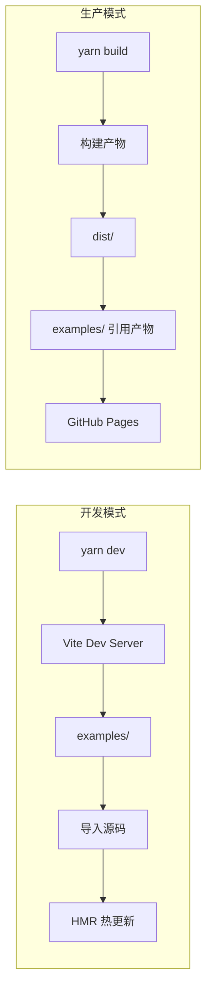

## 用户需求

用户希望统一 dev 开发（使用 vite）和 github io（使用 examples）两套环境，指出当前 vite 开发模式存在不合理之处。

## 产品概述

将当前分离的 Vite 开发环境和 Examples 部署环境统一为一套架构，实现"开发即部署"的体验：开发时直接编辑 examples 目录，生产部署直接使用 examples 目录。

## 核心功能

- 统一入口：examples 目录同时作为开发入口和部署产物
- 开发模式：直接导入源码，支持 HMR 热更新
- 生产模式：引用构建后的产物
- 简化维护：消除两套 HTML 入口和重复的配置逻辑

## 技术栈选择

- **构建工具**：Vite 6.x（项目已使用）
- **开发模式**：ES Module 动态导入 + HMR
- **部署方式**：GitHub Pages（静态文件服务）

## 实现方案

### 方案核心：将 Examples 作为 Vite 开发根目录

```
当前架构：
packages/cherry-markdown/
├── vite.config.ts    # root: packages/cherry-markdown
├── index.html        # 单一入口 + switch-case 路由
└── src/              # 源码

examples/             # 独立的 HTML 文件，引用构建产物
├── index.html
├── h5.html
└── ...

目标架构：
vite.config.ts        # root: examples/
examples/             # 开发入口 + 部署产物（统一）
├── index.html        # 开发时导入源码，部署时引用产物
├── h5.html
└── assets/
packages/cherry-markdown/
└── src/              # 源码（通过 alias 引用）
```

### 关键技术决策

1. **Vite 配置重构**

- 将 `vite.config.ts` 移至项目根目录
- `root` 改为 `examples/`
- 配置 alias 将 `@cherry` 指向源码目录

2. **HTML 文件动态导入**

- 使用 `import.meta.env.DEV` 区分开发/生产环境
- 开发时：`import Cherry from '@cherry/src/index.js'`
- 生产时：`<script src="../packages/cherry-markdown/dist/cherry-markdown.js">`

3. **样式处理**

- 开发时：`import '@cherry/src/sass/index.scss'`
- 生产时：`<link href="../packages/cherry-markdown/dist/cherry-markdown.css">`

4. **删除冗余代码**

- 删除 `packages/cherry-markdown/index.html`
- 删除 `spaFallback` 插件和 `paths` 数组
- 删除 `devCompatibleConfig` 配置

### 架构优势



## 实现细节

### 核心目录结构（变更部分）

```
d:/GithubDesktop/cherry-markdown/
├── vite.config.ts                    # [NEW] 根目录 Vite 配置，root 指向 examples
├── package.json                      # [MODIFY] 更新 dev 脚本命令
├── examples/
│   ├── index.html                    # [MODIFY] 支持动态导入源码/产物
│   ├── h5.html                       # [MODIFY] 支持动态导入源码/产物
│   ├── multiple.html                 # [MODIFY] 支持动态导入源码/产物
│   ├── notoolbar.html                # [MODIFY] 支持动态导入源码/产物
│   ├── preview_only.html             # [MODIFY] 支持动态导入源码/产物
│   ├── img.html                      # [MODIFY] 支持动态导入源码/产物
│   ├── table.html                    # [MODIFY] 支持动态导入源码/产物
│   ├── head_num.html                 # [MODIFY] 支持动态导入源码/产物
│   ├── xss.html                      # [MODIFY] 支持动态导入源码/产物
│   └── ai_chat.html                  # [MODIFY] 支持动态导入源码/产物
└── packages/cherry-markdown/
    ├── vite.config.ts                # [DELETE] 不再需要
    └── index.html                    # [DELETE] 不再需要
```

### Vite 配置关键代码

```typescript
// vite.config.ts (根目录)
export default defineConfig({
  root: path.resolve(__dirname, 'examples'),
  resolve: {
    alias: {
      '@cherry': path.resolve(__dirname, 'packages/cherry-markdown'),
    },
  },
  server: {
    port: 5173,
    fs: { allow: ['..'] },
  },
});
```

### HTML 模板改造示例

```html
<!-- examples/index.html -->
<!doctype html>
<html>
<head>
  <!-- 生产模式样式 -->
  <link rel="stylesheet" href="../packages/cherry-markdown/dist/cherry-markdown.css" />
</head>
<body>
  <div id="markdown"></div>
  <script type="module">
    // 动态导入：开发时用源码，生产时用产物
    const Cherry = import.meta.env.DEV 
      ? (await import('@cherry/src/index.js')).default
      : window.Cherry;
    
    if (import.meta.env.DEV) {
      await import('@cherry/src/sass/index.scss');
    }
    
    const config = { /* ... */ };
    window.cherry = new Cherry(config);
  </script>
  <!-- 生产模式脚本（仅在非开发环境加载） -->
  <script src="../packages/cherry-markdown/dist/cherry-markdown.js"></script>
</body>
</html>
```

### 性能与兼容性考量

1. **HMR 性能**：开发时直接导入源码，Vite 原生支持，无需额外插件
2. **路径处理**：相对路径资源通过 Vite 自动处理，无需 `devCompatibleConfig`
3. **构建兼容**：保留原有构建流程，不影响 npm 包发布
4. **部署兼容**：examples 目录结构不变，GitHub Pages 部署无需修改