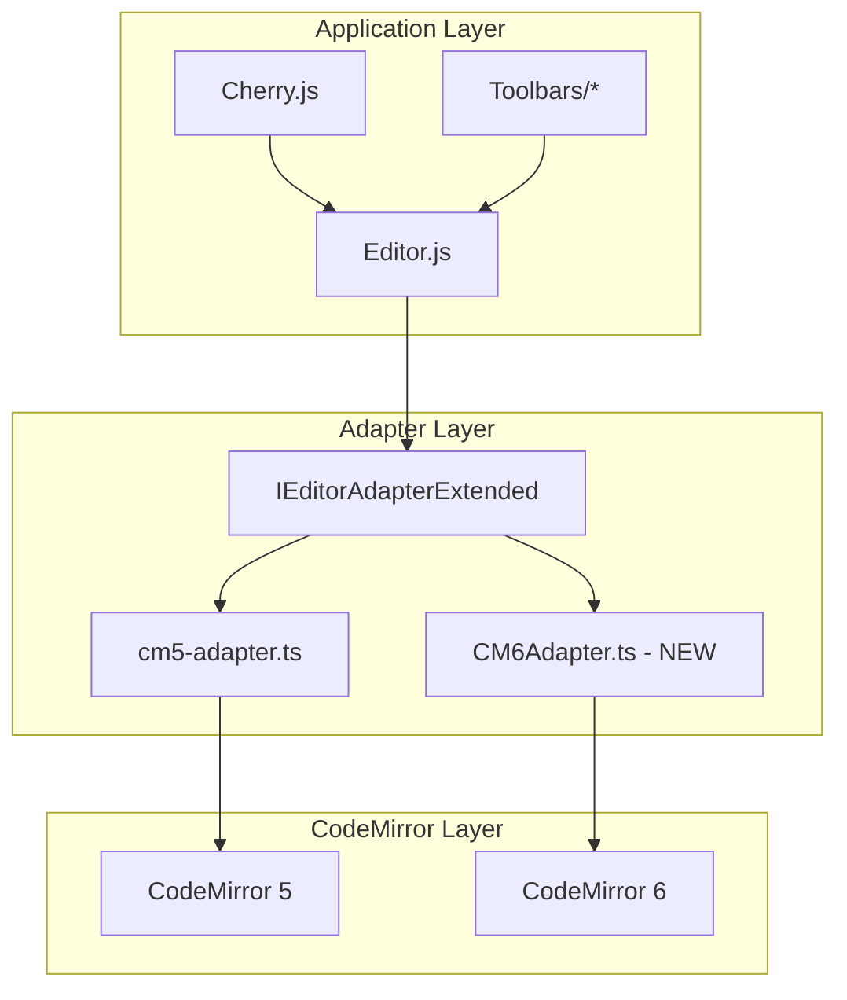

## 用户需求

将 CodeMirror 从版本 5 升级到版本 6，并确保所有现有测试通过。

## 产品概述

Cherry Markdown 是一个基于 CodeMirror 5 的 Markdown 编辑器。升级到 CodeMirror 6 需要保持所有 API 行为一致，确保编辑器的表现和操作与升级前完全相同。

## 核心功能

- 保持编辑器所有核心功能正常工作：内容读写、光标操作、选区管理、撤销重做、搜索替换
- 保持所有工具栏操作正常：加粗、斜体、标题、列表、引用等 Markdown 格式化
- 保持滚动同步、浮动菜单、代码块编辑等高级功能
- 所有 2488 个单元测试 + 22 个视觉测试必须通过

## Tech Stack Selection

### 当前技术栈

- **编辑器核心**: CodeMirror 5.58.2
- **语言**: JavaScript (ES6+) + TypeScript (测试文件)
- **构建工具**: Rollup + Vite
- **测试框架**: Vitest (单元测试) + Playwright (视觉测试)

### 升级后技术栈

- **编辑器核心**: CodeMirror 6.x (模块化架构)
- **需要新增的 CM6 包**:
- `@codemirror/view` - 编辑器视图层
- `@codemirror/state` - 状态管理
- `@codemirror/commands` - 基础命令
- `@codemirror/history` - 撤销重做 (或 `@codemirror/commands` 内置)
- `@codemirror/search` - 搜索功能
- `@codemirror/lang-markdown` - Markdown 语言支持
- `@codemirror/lang-yaml` - YAML frontmatter 支持
- `@codemirror/theme-one-dark` - 主题支持 (可选)
- `@codemirror/language-data` - 代码块语法高亮
- `codemirror` - CM6 统一入口包

## Implementation Approach

### 策略概述

采用**适配器模式**，创建 CM6 适配器实现 `IEditorAdapterExtended` 接口，确保所有现有代码无需修改即可切换到 CM6。

### CM5 → CM6 API 映射

| CM5 API | CM6 等效实现 |
| --- | --- |
| `getValue()` | `view.state.doc.toString()` |
| `setValue(v)` | `view.dispatch({changes: {from:0, to:doc.length, insert:v}})` |
| `getCursor()` | `view.state.selection.main.head` → 转换为 `{line, ch}` |
| `setCursor(pos)` | `view.dispatch({selection: {anchor: posToOffset(pos)}})` |
| `getSelection()` | `view.state.sliceDoc(sel.from, sel.to)` |
| `setSelection(a,b)` | `view.dispatch({selection: {anchor, head}})` |
| `replaceSelection(t)` | `view.dispatch(view.state.replaceSelection(t))` |
| `on(event, handler)` | `view.dom.addEventListener` 或 `EditorView.updateListener` |
| `off(event, handler)` | 移除对应监听器 |
| `undo()` | `undo(view)` from `@codemirror/commands` |
| `redo()` | `redo(view)` from `@codemirror/commands` |
| `getSearchCursor(q)` | `SearchCursor` from `@codemirror/search` |
| `markText(from,to,opts)` | `Decoration.mark()` + `EditorView.decorations` |
| `scrollIntoView(pos)` | `view.dispatch({effects: EditorView.scrollIntoView()})` |
| `charCoords(pos)` | `view.coordsAt(posToOffset(pos))` |
| `indexFromPos(pos)` | 计算偏移量 (CM6 使用偏移量) |
| `posFromIndex(idx)` | 偏移量转换为 `{line, ch}` |
| `addOverlay()` | 使用 `Highlighter` 或 `Decoration` 替代 |
| `eachLine(start,end,cb)` | 遍历 `view.state.doc.iter()` |


### 实施步骤

**第一阶段：CM6 适配器核心实现**

1. 安装 CM6 依赖包
2. 创建 `src/adapters/CM6Adapter.ts` 实现 `IEditorAdapterExtended`
3. 实现核心内容/光标/选区操作
4. 实现事件系统转换层
5. 实现历史操作（undo/redo）

**第二阶段：高级功能适配**

1. 实现 `getSearchCursor` 搜索功能
2. 实现 `markText` 文本标记功能
3. 实现滚动相关 API
4. 实现坐标转换 API

**第三阶段：集成与验证**

1. 修改 `Editor.js` 支持适配器切换
2. 运行单元测试确保行为一致
3. 运行视觉测试确保外观一致
4. 处理边界情况和测试失败项

## Architecture Design



## Directory Structure

```
packages/cherry-markdown/
├── src/
│   ├── Editor.js                      # [MODIFY] 添加 CM6 初始化逻辑
│   ├── adapters/
│   │   └── CM6Adapter.ts              # [NEW] CM6 适配器核心实现
│   ├── utils/
│   │   ├── cm-search-replace.js       # [MODIFY] 适配 CM6 搜索 API
│   │   └── codeBlockContentHandler.js # [MODIFY] 使用适配器接口
│   └── ...
├── test/
│   ├── integration/
│   │   ├── cm5-adapter.ts             # [KEEP] CM5 适配器参考
│   │   └── cm6-behavior-verification.spec.ts  # [MODIFY] 启用真实 CM6 测试
│   └── unit/behavior/
│       └── editor-adapter-extended.spec.ts    # [KEEP] 行为测试基准
└── package.json                       # [MODIFY] 添加 CM6 依赖
```

## Key Code Structures

### CM6Adapter 核心接口

```typescript
// src/adapters/CM6Adapter.ts
import { EditorView, basicSetup } from 'codemirror';
import { EditorState, SelectionRange, RangeSet } from '@codemirror/state';
import { markdown, markdownLanguage } from '@codemirror/lang-markdown';
import { history, undo, redo } from '@codemirror/commands';
import { search, SearchCursor } from '@codemirror/search';
import type { IEditorAdapterExtended, Position, SelectionRange } from '../test/unit/behavior/editor-adapter-extended.spec';

export class CM6Adapter implements IEditorAdapterExtended {
  private view: EditorView;
  private eventHandlers: Map<EditorEventType, Set<EditorEventHandler>>;
  private decorations: RangeSet<Decoration>;
  
  constructor(container: HTMLElement, options: Record<string, any>) {
    // 初始化 CM6 编辑器
    this.view = new EditorView({
      parent: container,
      state: EditorState.create({
        extensions: [
          basicSetup,
          markdown({ base: markdownLanguage }),
          history(),
          search(),
          // 自定义更新监听器，转换 CM6 事件为 CM5 风格
          EditorView.updateListener.of((update) => {
            if (update.docChanged) this.triggerEvent('change');
            if (update.selectionSet) this.triggerEvent('cursorActivity');
          }),
        ],
      }),
    });
  }
  
  // 核心 API 实现
  getValue(): string { return this.view.state.doc.toString(); }
  setValue(value: string): void { /* 实现 */ }
  getCursor(): Position { /* 转换 offset → {line, ch} */ }
  setCursor(pos: Position): void { /* 转换 {line, ch} → offset */ }
  // ... 其他 40+ 个 API
}
```

### 位置转换工具

```typescript
// 辅助函数：{line, ch} ↔ offset
function posToOffset(doc: Text, pos: Position): number {
  return doc.line(pos.line + 1).from + pos.ch; // CM6 行号从 1 开始
}

function offsetToPos(doc: Text, offset: number): Position {
  const line = doc.lineAt(offset);
  return { line: line.number - 1, ch: offset - line.from }; // CM5 格式
}
```

## Implementation Notes

1. **行号差异**: CM5 行号从 0 开始，CM6 从 1 开始，所有位置转换需要 +1/-1
2. **事件模型**: CM6 使用 `updateListener` 替代 CM5 的 `on/off`，需要建立事件映射层
3. **markText 实现**: CM6 使用 Decoration 系统，需要维护一个 decorations 状态扩展
4. **addOverlay 替代**: CM6 不支持 overlay，需要用 `syntaxHighlighting` 或自定义 `LanguageSupport` 替代
5. **搜索功能**: 使用 `@codemirror/search` 的 `SearchCursor` 重新实现 `getSearchCursor`
6. **内存管理**: CM6 编辑器销毁时调用 `view.destroy()` 防止内存泄漏

## Agent Extensions

### SubAgent

- **code-explorer**
- Purpose: 深入探索 CM5 API 在所有文件中的使用模式，确保升级不遗漏任何 API 调用
- Expected outcome: 生成完整的 CM5 API 调用清单和对应的 CM6 映射方案