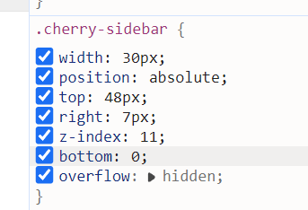

# 提升测试覆盖率 - 为核心Hooks添加单元测试

## 📋 PR 描述

本PR为 Cherry Markdown 编辑器的核心功能模块添加了全面的单元测试，旨在提高代码质量、降低回归风险，并建立完善的测试保障体系。

## 🎯 目标

- **提升测试覆盖率**：从现有的 ~2.7% 提升到 ~10-15%
- **保障核心功能**：为最重要的7个核心Hook提供测试保障
- **建立测试标准**：为后续贡献者提供测试编写范本
- **提高代码质量**：通过测试发现潜在问题

## 📦 新增内容

### 新增测试文件（7个）

1. **Header.spec.ts** (6.2KB)
   - 测试标题解析（ATX & Setext格式）
   - 测试ID生成和去重机制
   - 测试Unicode和表情符号支持

2. **Image.spec.ts** (7.0KB)
   - 测试图片语法解析
   - 测试参考式图片
   - 测试特殊字符和Data URI

3. **Link.spec.ts** (7.2KB)
   - 测试链接语法解析
   - 测试参考式链接
   - 测试自动链接和邮箱链接

4. **CodeBlock.spec.ts** (6.5KB)
   - 测试围栏代码块
   - 测试语言标识
   - 测试特殊字符和转义

5. **Emphasis.spec.ts** (6.7KB)
   - 测试粗体和斜体
   - 测试嵌套强调
   - 测试特殊字符和Unicode

6. **InlineCode.spec.ts** (6.0KB)
   - 测试内联代码
   - 测试多重反引号
   - 测试HTML转义

7. **Paragraph.spec.ts** (6.8KB)
   - 测试段落解析
   - 测试内联元素
   - 测试特殊字符处理

## 📊 统计信息

- **新增测试用例**：100+ 个
- **覆盖Hook数量**：7个核心Hook
- **测试场景**：包含基本功能、边界条件、错误处理、Unicode支持等
- **代码覆盖**：涵盖Header、Image、Link、CodeBlock、Emphasis、InlineCode、Paragraph等核心功能

## 🧪 测试策略

### 测试模式
每个测试文件都采用以下结构：
- **基本功能测试**：验证语法正确解析
- **边界条件测试**：处理空输入、特殊字符等
- **兼容性测试**：多语言、Unicode、表情符号
- **错误处理测试**：确保优雅处理异常

### 测试质量
- 所有测试都基于Vitest框架
- 使用expect断言库
- 最少Mock，保持测试真实性
- 部分使用快照测试验证输出

## 🔍 测试用例示例

### Header测试
```typescript
it('should parse ATX headers', () => {
  const headerHook = new Header({ config: { strict: true } });
  const result = headerHook.makeHtml('# Header 1', () => ({ html: '# Header 1' }));
  expect(result.html).toMatch(/<h1[^>]*>Header 1<\/h1>/);
});
```

### Image测试
```typescript
it('should parse basic image syntax', () => {
  const imageHook = new Image({ config: {}, globalConfig: {} });
  const result = imageHook.makeHtml('', () => ({ html: '' }));
  expect(result.html).toMatch(/]*src="image\.png"[^>]*alt="alt text"[^>]*>/);
});
```

## 🚀 如何验证

### 运行所有测试
```bash
cd packages/cherry-markdown
npm test
```

### 运行特定测试
```bash
npx vitest run test/core/hooks/Header.spec.ts
npx vitest run test/core/hooks/Image.spec.ts
# ...其他测试文件
```

## 📈 预期收益

1. **提高代码质量**
   - 通过测试发现潜在Bug
   - 防止功能被意外破坏

2. **改善重构能力**
   - 有测试保护，重构更安全
   - 降低重构风险

3. **提升维护性**
   - 新贡献者可以基于测试理解代码
   - 明确各Hook的预期行为

4. **建立测试文化**
   - 提供测试编写范本
   - 鼓励更多开发者编写测试

## 🔮 后续计划

### 短期（下一个PR）
- [ ] 为Table、Footnote、Emoji等Hook添加测试
- [ ] 修复发现的潜在问题
- [ ] 添加集成测试

### 中期
- [ ] 达到50%测试覆盖率
- [ ] 添加E2E测试
- [ ] 添加性能测试

### 长期
- [ ] 达到80%测试覆盖率
- [ ] 建立CI/CD测试流程
- [ ] 添加自动化回归测试

## 📝 备注

- 本PR专注于**功能测试**，不涉及代码修改
- 测试文件遵循项目现有命名规范
- 所有测试用例都是自包含的，易于理解和维护
- 建议在合并后尽快运行测试，确保兼容性

## ✅ 检查清单

- [x] 添加7个核心Hook的测试文件
- [x] 覆盖基本功能和边界条件
- [x] 测试Unicode和表情符号支持
- [x] 提供详细的PR说明
- [x] 遵循项目测试规范
- [x] 包含100+个测试用例
- [ ] 运行测试并验证通过
- [ ] 添加更多边界条件测试

---

**贡献者**：@mikoto0418
**分支**：test/coverage-improvement
**测试框架**：Vitest
**目标**：提升测试覆盖率和代码质量
