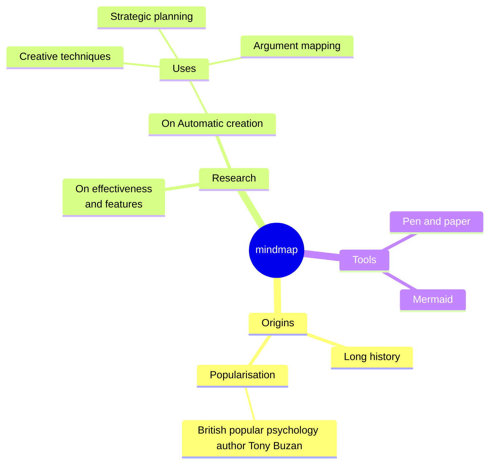
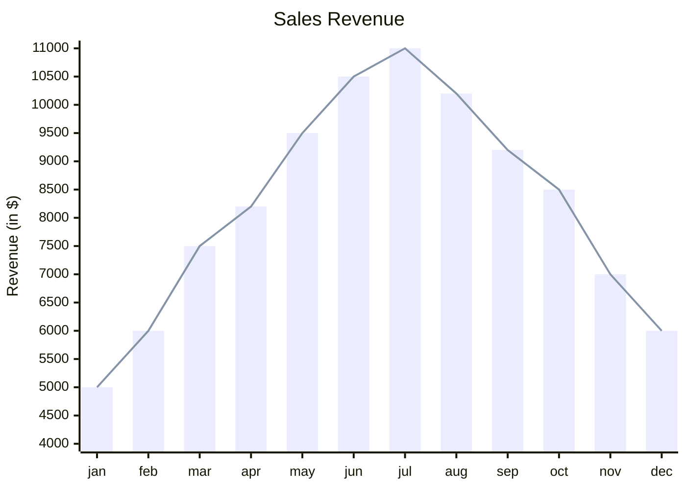
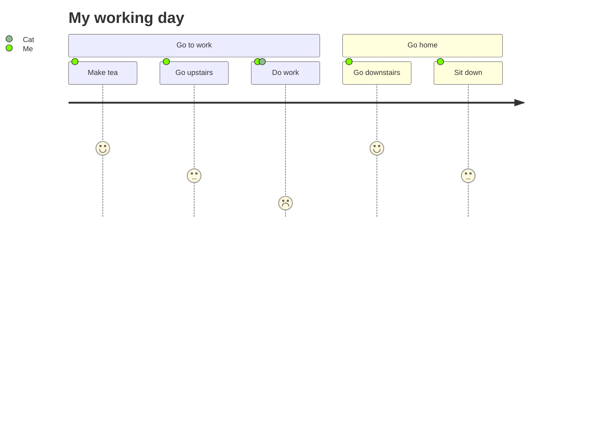

## 引入cherry并使用自己的[mermaid](https://mermaid.js.org/){target=_blank}
```html
<script src="https://cdn.jsdelivr.net/npm/mermaid@11.6.0/dist/mermaid.min.js"></script>
<script src="yourPath/cherry-markdown.core.js"></script>
<script src="yourPath/addons/cherry-code-block-mermaid-plugin.js"></script>
<script>
Cherry.usePlugin(CherryCodeBlockMermaidPlugin, {
  mermaid: window.mermaid,
  mermaidAPI: window.mermaid,
});
var cherryEditor = new Cherry({id: 'markdown'});
</script>
```

## 效果
> 可以使用对应版本mermaid的语法

- 思维导图：

- 统计图

- 计划

