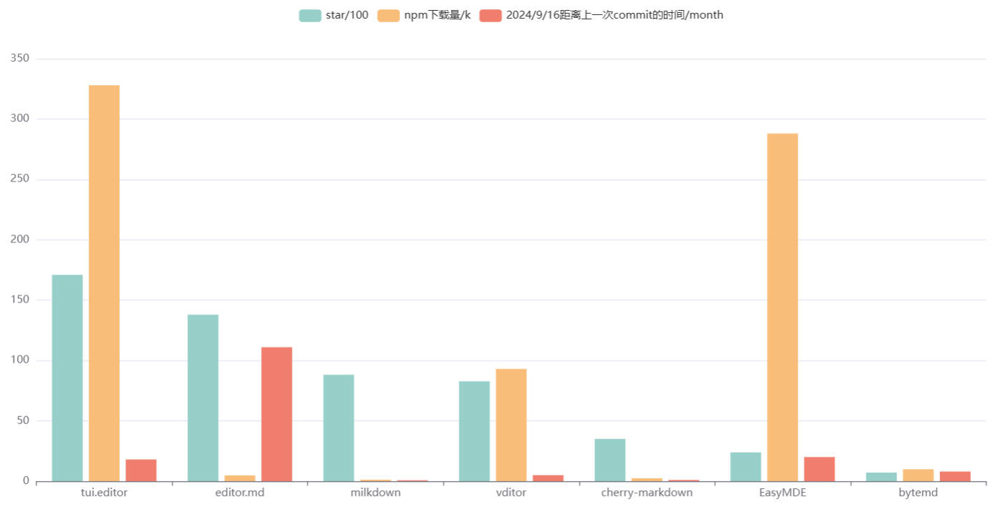

# Markdown编辑器对比分析

> NOTE: 参选项目均为可在前端项目中引入的第三方markdown编辑器库，而非富文本/代码编辑器或成熟的笔记软件。
>
> 该对比测评暂写于2024.8.25~2024.9.20。
>
> 本项目为腾讯犀牛鸟计划cherry-markdown课题实战项目中阶任务，[2024腾讯犀牛鸟开源人才培养计划—Cherry Markdown · Issue #41](https://github.com/Tencent/OpenSourceTalent/issues/41)

项目版本：

- cherry-markdown: https://github.com/Tencent/cherry-markdown/tree/v0.8.46
- EasyMDE :https://github.com/Ionaru/easy-markdown-editor/tree/2.18.0
- bytemd: https://github.com/bytedance/bytemd/tree/main
- milkdown: https://github.com/Milkdown/milkdown/tree/%40milkdown/kit%407.5.4
- tui.editor: https://github.com/nhn/tui.editor/tree/editor%403.2.2
- vditor: https://github.com/Vanessa219/vditor/tree/v3.10.4
- editor.md: https://github.com/pandao/editor.md/tree/v1.5.0

---

- marked: https://github.com/markedjs/marked/tree/v14.0.0
- lute：https://github.com/88250/lute/tree/v1.7.6
- remark: https://github.com/remarkjs/remark/tree/remark-cli%4012.0.0
- toastmark:  https://github.com/nhn/tui.editor/tree/editor%403.2.2/libs/toastmark

## 项目整体情况

| 名称            | star | license | 最近 commit 时间 | issue | pr | npm下载量 |
| --------------- | ---- | ------- | ---- | ---- | ---- | ---- |
| tui.editor      |      |         |      |      |      |      |
| editor.md          |      |         |      |      |      |      |
| milkdown         |      |         |      |      |      |      |
| vditor        |      |         |      |      |      |      |
| cherry-markdown          |      | Apache |      |      |      |      |
| EasyMDE |      |         |      |      |      |      |
| bytemd       |      |         |      |      |      |      |

开源许可证参考图：


表格数据柱状图：



### 分析

在柱状图中，从左到右 star 数依次减少。star 数越多说明项目越受全球开发者关注，而 npm 下载量越多说明项目被更多开发者和网站使用。而距离上一次 commit 的时间说明项目是否有在持续更新维护中，间隔时间越短说明更新越频繁。而表格中的 issue 和 pr 数量仅作为参考数据，因为数量多不一定是社区活跃，可能是项目无人维护导致 issue 和 pr 积压。

在这些项目中，EasyMDE 和 editor.md 相对较早。EasyMDE 是 9.9k star 项目 SimpleMDE 的 fork 项目(相当于2.0)，因此 star 较少但是使用量多。editor.md 可能主要是中国开发者使用，使用量少，star 偏多。

其他几个项目的最早提交都在最近的三到四年，由于宣传、项目功能等方面的差别，star 数有多有少。其中 tui.editor 来自 NHN 公司，开发投入应该较多，star数多，并且可能因为作为组件运用在它的其他产品中，所以下载量大。vditor 被用于链滴社区中，有较多的star和使用量，且更新较频繁，社区活跃。

milkdown 主要为作者一人开发，但更新频繁。它的 "插件驱动"设计理念相比其他markdown编辑器有一定特点，star数排第三，但使用门槛也较高，使用用户也相对较少，因此下载量偏低。

cherry-markdown 和 bytemd 分别是腾讯与字节跳动的团队开发的Markdown编辑器。bytemd 已经有一个正在开发的 v2 版本项目 hashmd ，但后者文档较不全面，因此先拿 bytemd 作为参选项目。可能由于 cherry-markdown 的宣传较晚，其使用量比起已经用于掘金社区的 bytemd 还是偏少，但有段时间 cherry-markdown 突然在 Github 上爆火，star 数飞涨并且目前远超 bytemd。同时 bytemd 和 hashmd 的最近一次 commit 都在 9 个月前，而 cherry-markdown 基本每周都有 commit 记录，社区较 bytemd 活跃。

Markdown 编辑器已经有很长的发展历史了，普通用户对于 Markdown 的需求可能就是 Markdown 文本转 HTML 元素，因此受到全球开发者认可的老项目如今也有不错的下载量和关注度。但类似 cherry-markdown 这样的新项目包含的具有特色的新功能，仍可以为开发的网站增加亮点、吸引用户，虽然当前的 star 和下载量较少，但相信在新项目中这些"新一代"编辑器会被越来越多的使用。


## 功能

均支持的功能：

- 分屏预览
- 工具栏
- 快捷键
- 图片上传、表格
- TODO列表
- 代码块高亮

> 功能参考自各项目文档介绍，如有遗漏或错误，欢迎指出。

### 基本功能

> WYSIWYG(所见即所得)：在编辑区即可进行 HTML 元素的渲染，类似 Typora 的效果。

|      名称       |     编辑模式      | 数学公式 |              可视化图              | 多主题 | 导出pdf | 拖拽上传 | 本地缓存 | 编辑区悬浮菜单栏 |     多语言      |
| :-------------: | :---------------: | :------: | :--------------------------------: | :----: | :-----: | :------: | :------: | :--------------: | :-------------: |
|     vditor      | WYSIWYG、分屏预览 |    ✅     | mermaid、Graphviz、五线谱、echarts |   ✅    |    ✅    |    ✅     |    ✅     |        ❌         |        ✅        |
|     bytemd      |     分屏预览      |    ✅     |              mermaid               |   ✅    |    ❌    |    ✅     |    ❌     |        ❌         |        ✅        |
|     EasyMDE     | WYSIWYG、分屏预览 |    ❌     |                 ❌                  |   ❌    |    ❌    |    ✅     |    ✅     |        ❌         |        ✅        |
|    milkdown     | WYSIWYG、分屏预览 |    ✅     |              mermaid               |   ✅    |    ❌    |    ❌     |    ❌     |        ❌         | 需手动设置name❌ |
|   tui.editor    | WYSIWYG、分屏预览 |    ✅     |             chart、UML             |   ✅    |    ❌    |    ✅     |    ❌     |        ❌         |        ✅        |
| cherry-markdown |     分屏预览      |    ✅     |   mermaid、md表格转为折线/柱状图   |   ✅    |    ✅    |    ✅     |    ❌     |        ✅         |        ✅        |
|    editor.md    |     分屏预览      |    ✅     |     flowchart、sequenceDiagram     |   ✅    |    ❌    |    ❌     |    ❌     |        ❌         |        ✅        |

### 较特殊的功能

|      名称       | 大纲 | FrontMatter | 图片缩放(media zoom) | Footnote | html自动转markdown |            预览区编辑            |
| :-------------: | :--: | :---------: | :------------------: | :------: | :----------------: | :------------------------------: |
|     vditor      |  ✅   |      ✅      |          ✅           |    ✅     |         ✅          | 仅WYSIWYG模式支持。块移动、表格✅ |
|     bytemd      |  ✅   |      ✅      |          ✅           |    ✅     |         ❌          |                ❌                 |
|     EasyMDE     |  ❌   |      ❌      |          ❌           |    ❌     |         ❌          |                ❌                 |
|    milkdown     |  ❌   |      ❌      |          ❌           |    ✅     |         ✅          |     创建元素、块移动、表格✅      |
|   tui.editor    |  ❌   |      ✅      |          ❌           |    ✅     |         ❌          |                ❌                 |
| cherry-markdown |  ✅   |      ❌      |          ❌           |    ✅     |         ✅          |        图大小缩放、表格✅         |
|    editor.md    |  ✅   |      ❌      |          ❌           |    ✅     |         ❌          |                ❌                 |

### 几乎独有的功能

| 名称            | 功能                                                         |
| --------------- | ------------------------------------------------------------ |
| vditor          | 导出为知乎或微信公众号的格式、评论、录音                     |
| bytemd          |                                                              |
| EasyMDE         |                                                              |
| milkdown        | 协同编辑                                                     |
| tui.editor      | 表格合并                                                     |
| cherry-markdown | 手风琴、集成draw.io、基于表格生成柱状和折线图、vim编辑模式、流式适配、可接入LLM、可更改图片对齐方式 |
| editor.md       |                                                              |

此处选取的编辑器未涉及到的更多Markdown相关功能可以参考：https://github.com/mundimark/awesome-markdown

### 总结
vditor和cherry-markdown比较亮眼。vditor作为老牌编辑器，功能非常完善。而cherry-markdown在基础功能上也实现的很全面，并且新增了很多特色功能如流式适配等。


## 扩展能力

| 名称            | 功能               | 工具栏                | 快捷键 | 样式 |
| --------------- | ------------------ | --------------------- | ------ | ---- |
| vditor          | ❌                  | ✅                     | ✅      | ✅    |
| bytemd          | 可通过插件新增功能 | ❌                     | ❌      | ✅    |
| EasyMDE         | ❌                  | ✅                     | ✅      | ✅    |
| milkdown        | ✅                  | 插件驱动，均可自定义✅ | ✅      | ✅    |
| tui.editor      | 可通过插件新增功能 | ✅                     | ❌      | ❌    |
| cherry-markdown | ❌                  | ✅                     | ✅      | ✅    |
| editor.md       | 可通过插件新增功能 | ✅                     | ✅      | ✅    |

## 语法能力

参考规范：
- [commonmark 0.31.2](https://spec.commonmark.org/0.31.2/)
- [GFM 0.29-gfm](https://github.github.com/gfm)

测试数据见 https://github.com/urlyy/mde-comparison/tree/main/datasets

均基本实现了commonmark，因此对commonmark进行通过率测试。

gfm有的实现了特定样式，故仅展示是否实现。

|名称| EasyMDE | bytemd | milkdown | vditor | cherry-markdown | tui.editor | editor.md |
| ------- | ------- | ------ | -------- | ------ | --------------- | --------------- | --------------- |
| CommonMark (652测试用例) | 470 | 474 | 474 | 578 | 211 | 571 | 470 |
| GFM | ✅ | ✅ | ✅ | ✅ | ✅ | ✅ | ✅ |
| 特殊语法 | ❌ | ❌ | ✅ | ❌ | ✅ | ✅ | ❌ |

各项目特殊语法相关文档：

- tui.editor: https://github.com/nhn/tui.editor/blob/master/docs/en/custom-block.md
- milkdown：https://milkdown.dev/docs/plugin/example-iframe-plugin
- cherry-markdown：https://github.com/Tencent/cherry-markdown/wiki/%E8%87%AA%E5%AE%9A%E4%B9%89%E8%AF%AD%E6%B3%95


## 引入成本 

下表数据基于 https://bundlephobia.com 的分析结果

> 1. 当前cherry-markdown与editor.md似乎未能被该网站分析,TODO
> 2. milkdown是由插件构成的编辑器，故最小化demo用到的代码偏少
> 3. 由于各项目的功能有些集成于主包，有的分散于插件，故该表数据仅供参考

|类型| EasyMDE | bytemd | milkdown | vditor | cherry-markdown | tui.editor | editor.md |
| -------| ------- | ------ | -------- | ------ | --------------- | --------------- | --------------- |
|   打包体积(kB)   | 315.9 | 622.9 | 1 | 267.2 |                 | 526.5 |                 |
|   打包+gzip后体积(kB)   | 103.2 | 190.5 | 0.636    | 63.9 |                 | 154.9 |                 |
| 3G网络下载时间(2G)(s) | 2.06 | 3.81 | 0.021 | 1.28 | | 3.1 | |
| 2G网络下载时间(ms) | 118 | 218 | 0.012 | 73 | | 177 | |

## 兼容性

- 浏览器版本(不打算对比)
- 由于参选项目均未使用特定框架如React、Vue等开发，因此兼容这些特定框架。

|类型| EasyMDE | bytemd | milkdown | vditor     | cherry-markdown | tui.editor | editor.md |
| :-----: | :----: | :------: | :--------: | :-------------: | :-------------: | :-------------: | :-------------: |
| 与React、Vue等框架兼容 | ✅ | ✅ | ✅ | ✅ | ✅ | ✅ | ✅ |
| 移动端适配(TODO)  | ✅ |          |  | ✅ | ✅ |  | ✅ |
|   SSR(TODO)   |         |   ✅    |          |        |                 |            |           |


## 性能
### 解析方案

Markdown渲染引擎一般采用AST或正则这两种方式。

| 类型 | 优点                                       | 缺点                                                 | 相关编辑器                                                   |
| ---- | ------------------------------------------ | ---------------------------------------------------- | ------------------------------------------------------------ |
| AST  | 比较容易实现符合规范的引擎，运行效率较高   | 使用门槛高，用户难以自行扩展                         | vditor(Lute)、EasyMDE(marked)、tui.editor(toastmark)、bytemd(remark)、editor.md(marked)、Milkdown(remark) |
| 正则 | 使用门槛低，实现较简单，方便用户自定义语法 | 很难完全实现符合GFM/Commonmark规范的解析，且性能较差 | cherry-markdown(自实现)                                      |

各项目测试代码见 https://github.com/urlyy/mde-comparison/tree/main/projects

测试数据见 https://github.com/urlyy/mde-comparison/tree/main/datasets

### 1. 解析器(初次渲染)

结合三个纯markdown解析器和两个项目中实现的解析器，进行对比。
- 
- 
- 

| 名称            | 中小文本初次渲染(ms) | 大文本初次渲染(ms) | 中小文本变更(ms) | 大文本变更(ms) | 备注 |
| --------------- | -------------------- | ----------------- | --------------- | ------------- | ---- |
| lute            | 4.73249              | 2102.60656        |                 |               |      |
| remark          | 8.67605              | 621.51755         |                 |               |      |
| marked          | 1.02415              | 47.94791          |                 |               |      |
| toastmark       | 2.51111              | 108.11728         |                 |               |      |
| cherry-markdown | 11.16318             | 607.96156         |                 |               |      |

### 2. 文本变更

TODO


## 安全
开源Markdown编辑器组件常见风险：

- 可能加载包含恶意脚本或内容的外部资源导致XSS攻击，如在编辑区加载到``。

- 恶意资源加载：某些编辑器支持加载外部资源，如图片、样式表或完整的网页(即`<iframe>`）。
  - 外部资源的提供者可以收集用户的信息如IP地址等。

      如在编辑区填入下方代码。

      ```
      <iframe
        width="100%"
        height="100%"
        src="http://localhost:3000"
      </iframe>
      ```

       收集用户信息的恶意服务器(nodejs)

      ```
      const express = require('express');
      const app = express();
      const port = process.env.PORT || 3000;
      app.get('/', (req, res) => {
          const ip = req.ip;
          res.send(`Your IP address is:  ${ip}`);
      });
      app.listen(port, () => {
        console.log(`Server is running at http://localhost:${port}`);
      });
      ```

  - 通过透明或伪装的`<iframe>`诱骗用户执行非预期操作。

> 考虑到编辑器组件应聚焦于编辑与展示，CSP、权限控制等应交给客户端上层或服务端处理。本分析仅考虑能否应对XSS攻击。

常用解决方案：

- 实现Sanitizer以替换或移除潜在有害的HTML代码。如将`<`转为`&lt;`，将`>`转为`&gt;`。可以使用安全的Markdown解析库。
- 配置内容安全策略(CSP)，限制编辑器可加载的资源来源。
- 禁用`iframe`标签。
- 使用`<iframe>`的`sandbox`属性来增强安全性。


|风险类型| EasyMDE | bytemd | milkdown | vditor | cherry-markdown | tui.editor | editor.md |
|:-----:| :-----: | ------ | -------- | ------ | --------------- | --------------- | --------------- |
|XSS| 默认有风险❌，但提供自定义Sanitizer接口 | 开✅ | 不支持渲染HTML标签✅ | 支持开关✅ | 支持开关✅ | 开✅ | 支持开关✅ |
