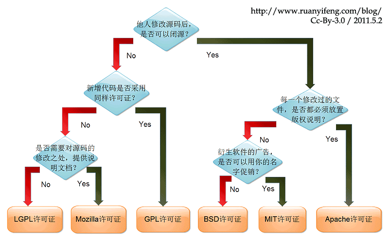

# Markdown编辑器对比分析

> NOTE: 参选项目均为可在前端项目中引入的第三方markdown编辑器库，而非富文本/代码编辑器或成熟的笔记软件。
>
> 该对比测评暂写于2024.8.25~2024.9.5。
>
> 本项目为腾讯犀牛鸟计划cherry-markdown课题实战项目中阶任务，[2024腾讯犀牛鸟开源人才培养计划—Cherry Markdown · Issue #41](https://github.com/Tencent/OpenSourceTalent/issues/41)
>
> TODO：深入各个项目的源码实现，进行语法覆盖率与性能测试

项目版本：

- cherry-markdown: https://github.com/Tencent/cherry-markdown/tree/v0.8.46
- EasyMDE :https://github.com/Ionaru/easy-markdown-editor/tree/2.18.0
- bytemd: https://github.com/bytedance/bytemd/tree/main
- milkdown: https://github.com/Milkdown/milkdown/tree/%40milkdown/kit%407.5.4
- tui.editor: https://github.com/nhn/tui.editor/tree/editor%403.2.2
- vditor: https://github.com/Vanessa219/vditor/tree/v3.10.4
- editor.md: https://github.com/pandao/editor.md/tree/v1.5.0

-- -

- commonmark.js: https://github.com/commonmark/commonmark.js/tree/0.31.1
- markdown-it: https://github.com/markdown-it/markdown-it/tree/14.1.0
- marked: https://github.com/markedjs/marked/tree/v14.0.0
- lute：https://github.com/88250/lute/tree/v1.7.6


## 项目整体情况

### 1. Star
- 
- 
- 
- 
- 
- 
- 


### 2. 开源协议
- (插件未能检测到，实际为Apache)
- 
- 
- 
- 
- 
- 
- 


​    
开源协议参考图：


### 3. 最近更新时间/issue/pr
- 
- 
- 
- 
- 
- 
- 
- 


### 4. npm下载量
- 
- 
- 
- 
- 
- 
- 
- 


### 5. 总结
TODO 对于上方各维度生成柱状图并给予分析

#### 功能

均支持的功能：

- 分屏预览
- 工具栏
- 快捷键
- 图片上传、表格
- TODO列表
- 代码块高亮

> 功能参考自各项目文档介绍，如有遗漏或错误，欢迎指出。

##### 基本功能

> WYSIWYG(所见即所得)：在编辑区即可进行Markdown渲染，类似Typora。

|      名称       |     编辑模式      | 数学公式 |              可视化图              | 多主题 | 导出pdf | 拖拽上传 | 本地缓存 | 编辑区悬浮菜单栏 |     多语言      |
| :-------------: | :---------------: | :------: | :--------------------------------: | :----: | :-----: | :------: | :------: | :--------------: | :-------------: |
|     vditor      | WYSIWYG、分屏预览 |    ✅     | mermaid、Graphviz、五线谱、echarts |   ✅    |    ✅    |    ✅     |    ✅     |        ❌         |        ✅        |
|     bytemd      |     分屏预览      |    ✅     |              mermaid               |   ✅    |    ❌    |    ✅     |    ❌     |        ❌         |        ✅        |
|     EasyMDE     | WYSIWYG、分屏预览 |    ❌     |                 ❌                  |   ❌    |    ❌    |    ✅     |    ✅     |        ❌         |        ✅        |
|    milkdown     | WYSIWYG、分屏预览 |    ✅     |              mermaid               |   ✅    |    ❌    |    ❌     |    ❌     |        ❌         | 需手动设置name❌ |
|   tui.editor    | WYSIWYG、分屏预览 |    ✅     |             chart、UML             |   ✅    |    ❌    |    ✅     |    ❌     |        ❌         |        ✅        |
| cherry-markdown |     分屏预览      |    ✅     |   mermaid、md表格转为折线/柱状图   |   ✅    |    ✅    |    ✅     |    ❌     |        ✅         |        ✅        |
|    editor.md    |     分屏预览      |    ✅     |     flowchart、sequenceDiagram     |   ✅    |    ❌    |    ❌     |    ❌     |        ❌         |        ✅        |

较特殊的功能

|      名称       | 大纲 | FrontMatter | 图片缩放(media zoom) | Footnote | html自动转markdown |            预览区编辑            |
| :-------------: | :--: | :---------: | :------------------: | :------: | :----------------: | :------------------------------: |
|     vditor      |  ✅   |      ✅      |          ✅           |    ✅     |         ✅          | 仅WYSIWYG模式支持。块移动、表格✅ |
|     bytemd      |  ✅   |      ✅      |          ✅           |    ✅     |         ❌          |                ❌                 |
|     EasyMDE     |  ❌   |      ❌      |          ❌           |    ❌     |         ❌          |                ❌                 |
|    milkdown     |  ❌   |      ❌      |          ❌           |    ✅     |         ✅          |     创建元素、块移动、表格✅      |
|   tui.editor    |  ❌   |      ✅      |          ❌           |    ✅     |         ❌          |                ❌                 |
| cherry-markdown |  ✅   |      ❌      |          ❌           |    ✅     |         ✅          |        图大小缩放、表格✅         |
|    editor.md    |  ✅   |      ❌      |          ❌           |    ✅     |         ❌          |                ❌                 |

几乎独有的功能

| 名称            | 功能                                                         |
| --------------- | ------------------------------------------------------------ |
| vditor          | 导出为知乎或微信公众号的格式、评论、录音                     |
| bytemd          |                                                              |
| EasyMDE         |                                                              |
| milkdown        | 协同编辑                                                     |
| tui.editor      | 表格合并                                                     |
| cherry-markdown | 手风琴、集成draw.io、基于表格生成柱状和折线图、vim编辑模式、流式适配、可接入LLM、可更改图片对齐方式 |
| editor.md       |                                                              |

此处选取的编辑器未涉及到的更多Markdown相关功能可以参考：https://github.com/mundimark/awesome-markdown

## 扩展能力

| 名称            | 功能               | 工具栏                | 快捷键 | 样式 |
| --------------- | ------------------ | --------------------- | ------ | ---- |
| vditor          | ❌                  | ✅                     | ✅      | ✅    |
| bytemd          | 可通过插件新增功能 | ❌                     | ❌      | ✅    |
| EasyMDE         | ❌                  | ✅                     | ✅      | ✅    |
| milkdown        | ✅                  | 插件驱动，均可自定义✅ | ✅      | ✅    |
| tui.editor      | 可通过插件新增功能 | ✅                     | ❌      | ❌    |
| cherry-markdown | ❌                  | ✅                     | ✅      | ✅    |
| editor.md       | 可通过插件新增功能 | ✅                     | ✅      | ✅    |

## 语法能力

参考规范：
- [commonmark 0.31.2](https://spec.commonmark.org/0.31.2/)
- [GFM 0.29-gfm](https://github.github.com/gfm)


均基本实现了commonmark和gfm，需要后续使用commonmark和GFM的测试集查看通过率。TODO

|名称| EasyMDE | bytemd | milkdown | vditor | cherry-markdown | tui.editor | editor.md |
| ------- | ------- | ------ | -------- | ------ | --------------- | --------------- | --------------- |
| CommonMark |         |        |          |  |                 |  |                 |
| GFM |         |        |          |  |                 |  |                 |
| 特殊语法 | ❌ | ❌ | ✅ | ❌ | ✅ | ✅ | ❌ |

各项目特殊语法相关文档：

- tui.editor: https://github.com/nhn/tui.editor/blob/master/docs/en/custom-block.md
- cherry-markdown：https://github.com/Tencent/cherry-markdown/wiki/%E8%87%AA%E5%AE%9A%E4%B9%89%E8%AF%AD%E6%B3%95
- milkdown：https://milkdown.dev/docs/plugin/example-iframe-plugin

## 引入成本 

下表数据基于 https://bundlephobia.com 的分析结果

> 1. 当前cherry-markdown与editor.md似乎未能被该网站分析,TODO
> 2. milkdown是由插件构成的编辑器，故最小化demo用到的代码偏少
> 3. 由于各项目的功能有些集成于主包，有的分散于插件，故该表数据仅供参考

|类型| EasyMDE | bytemd | milkdown | vditor | cherry-markdown | tui.editor | editor.md |
| -------| ------- | ------ | -------- | ------ | --------------- | --------------- | --------------- |
|   打包体积(kB)   | 315.9 | 622.9 | 1 | 267.2 |                 | 526.5 |                 |
|   打包+gzip后体积(kB)   | 103.2 | 190.5 | 0.636    | 63.9 |                 | 154.9 |                 |
| 3G网络下载时间(2G)(s) | 2.06 | 3.81 | 0.021 | 1.28 | | 3.1 | |
| 2G网络下载时间(ms) | 118 | 218 | 0.012 | 73 | | 177 | |

## 兼容性

TODO

|类型| EasyMDE | bytemd | milkdown | vditor     | cherry-markdown | tui.editor | editor.md |
| :-----: | :----: | :------: | :--------: | :-------------: | :-------------: | :-------------: | :-------------: |
|  浏览器版本       |  |          |  |  |                 |  |                 |
|   移动端适配  | ✅ |          |  | ✅ | ✅ |  | ✅ |
|   与开发框架集成   | Vanilla | Svelte、React、Vue、Vanilla、SSR | React、Vue、Svelte、Solidjs、Nextjs、Nuxtjs、Angular、Vue2 | Vanilla、React、Vue、Angular | Vanilla、all? | Vanilla、Vue、React、 | Jquery |

## 性能
### 解析方案

Markdown渲染引擎一般采用AST或正则这两种方式。

| 类型 | 优点                                       | 缺点                                                 | 相关编辑器                                                   |
| ---- | ------------------------------------------ | ---------------------------------------------------- | ------------------------------------------------------------ |
| AST  | 比较容易实现符合规范的引擎，运行效率较高   | 使用门槛高，用户难以自行扩展                         | vditor(Lute)、EasyMDE(marked)、tui.editor(自实现)、bytemd(remark)、editor.md(marked)、Milkdown(remark) |
| 正则 | 使用门槛低，实现较简单，方便用户自定义语法 | 很难完全实现符合GFM/Commonmark规范的解析，且性能较差 | cherry-markdown(自实现)                                      |

### 1. 解析器              

结合三个纯markdown解析器进行对比
- 
- 
- 
- 


TODO

### 2. onChange时的性能

TODO


## 安全
开源Markdown编辑器常见风险：

- 可能加载包含恶意脚本或内容的外部资源导致XSS攻击，如在编辑区中填入``。

- 恶意资源加载：某些编辑器支持加载外部资源，如图片、样式表或完整的网页(即`<iframe>`）。
  - 外部资源的提供者可以收集用户的信息如IP地址等。

      如在编辑区填入下方代码。

      ```
      <iframe
        width="100%"
        height="100%"
        src="http://localhost:3000"
      </iframe>
      ```

       收集用户信息的恶意服务器(nodejs)

      ```
      const express = require('express');
      const app = express();
      const port = process.env.PORT || 3000;
      app.get('/', (req, res) => {
          const ip = req.ip;
          res.send(`Your IP address is:  ${ip}`);
      });
      app.listen(port, () => {
        console.log(`Server is running at http://localhost:${port}`);
      });
      ```

  - 通过透明或伪装的`<iframe>`诱骗用户执行非预期操作。

常用解决方案：

- 实现Sanitizer以移除潜在有害的HTML代码。如将`<`转为`&lt;`，将`>`转为`&gt;`。可以使用安全的Markdown解析库，如`marked`、`remark`等。
- 配置内容安全策略(CSP)，限制编辑器可加载的资源来源。
- 禁用`iframe`标签。
- 使用`<iframe>`的`sandbox`属性来增强安全性。


|风险类型| EasyMDE | bytemd | milkdown | vditor | cherry-markdown | tui.editor | editor.md |
|:-----:| :-----: | ------ | -------- | ------ | --------------- | --------------- | --------------- |
|XSS| 默认有风险❌，但提供自定义Sanitizer接口 | 开✅ | 不支持渲染HTML标签✅ | 支持开关✅ | 支持开关✅ | 开✅ | 支持开关✅ |
