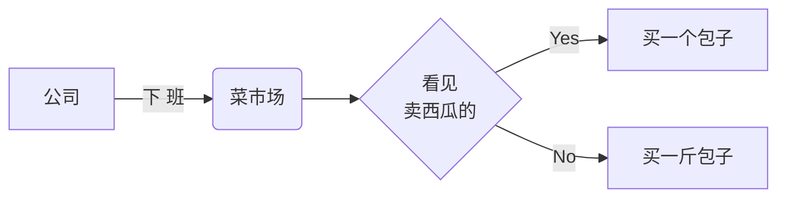
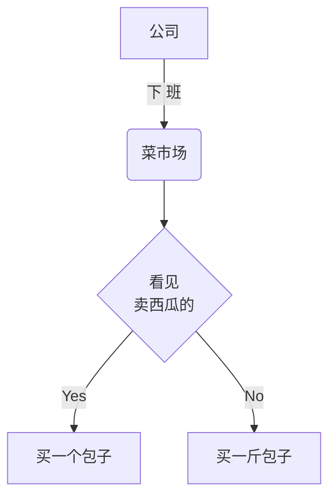
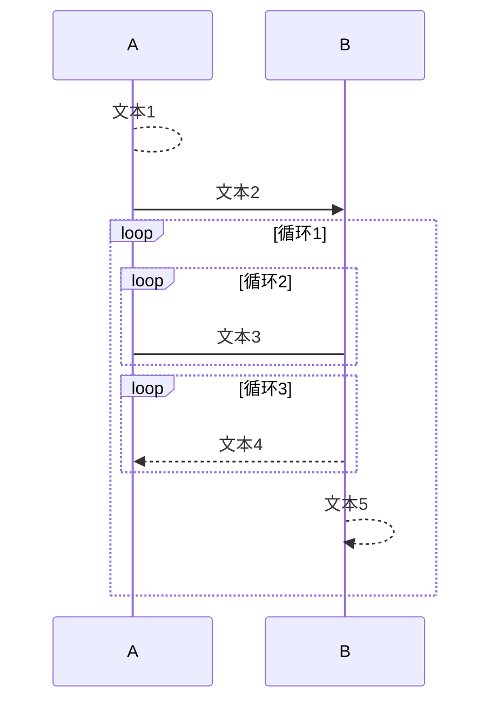
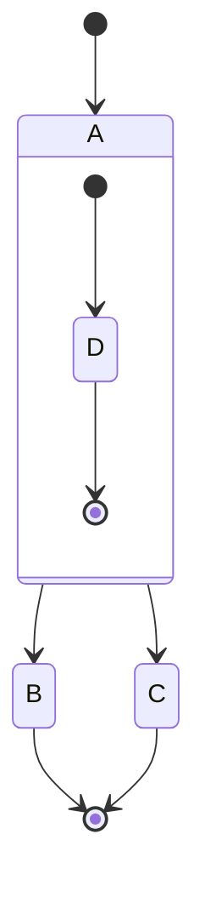
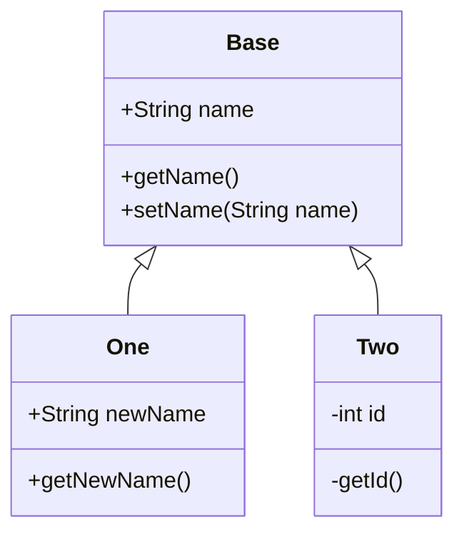
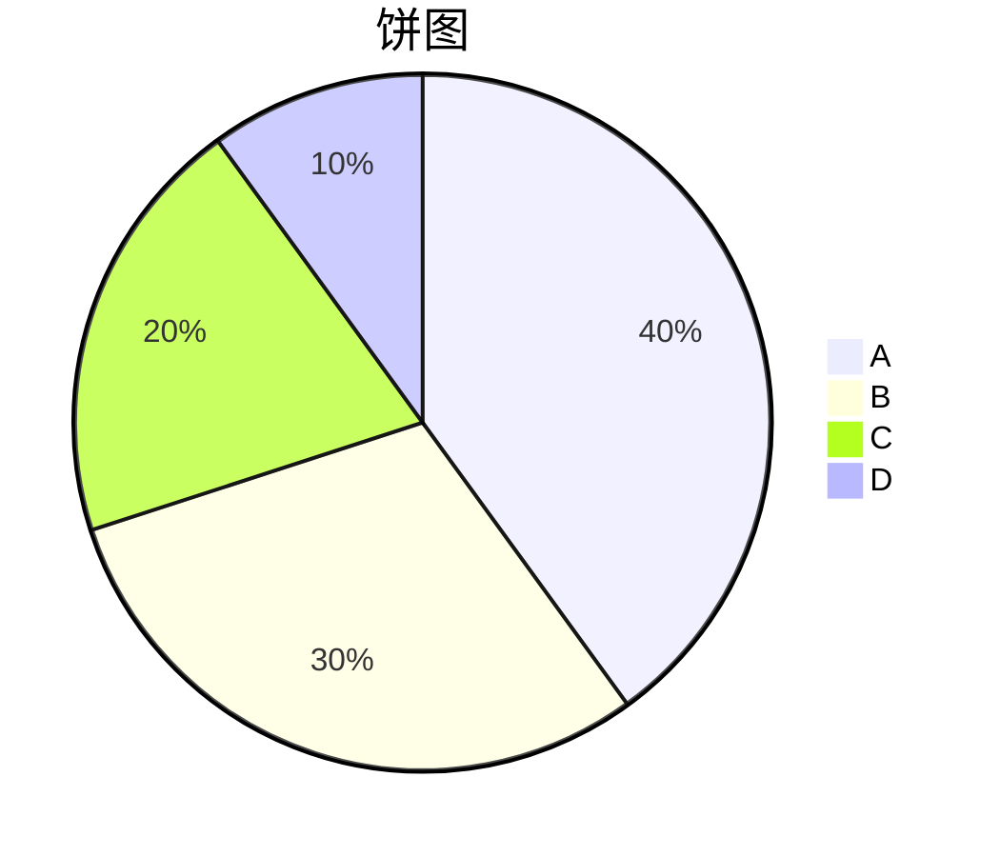

# 例子

> [Github 地址](https://github.com/Tencent/cherry-markdown){target=_blank}

- [full model](index.html){target=_blank}
- [basic](basic.html){target=_blank}
- [H5](h5.html){target=_blank}
- [多实例](multiple.html){target=_blank}
- [无 toolbar](notoolbar.html){target=_blank}
- [纯预览模式](preview_only.html){target=_blank}
- [注入](xss.html){target=_blank}
- [API](api.html){target=_blank}
- [图片所见即所得编辑尺寸](img.html){target=_blank}
- [表格所见即所得编辑尺寸](table.html){target=_blank}
- [标题自动序号](head_num.html){target=_blank}
- [流式输入模式（AI chart场景）](ai_chat.html){target=_blank}
- [VIM 编辑模式](vim.html){target=_blank}
- [应用mermaid version 10版本以上](mermaid.html){target=_blank}
- [自定义代码块外层容器](custom_codeblock_wrapper.html){target=_blank}


## 配置生成器
[配置生成器](config_helper/index.html){target=_blank}


# Cherry Markdown  { 简明手册 | jiǎn míng shǒu cè }

[[toc]]

# 基本语法

---

## 字体样式

**说明**

- 使用`*(或_)` 和 `**(或__)` 表示*斜体*和 **粗体**
- 使用 `/` 表示 /下划线/ ,使用`~~` 表示~~删除线~~
- 使用`^(或^^)`表示^上标^或^^下标^^
- 使用 ! 号+数字 表示字体 !24 大! !12 小! [^专有语法提醒]
- 使用两个(三个)!号+RGB 颜色 表示!!#ff0000 字体颜色!!(!!!#f9cb9c 背景颜色!!!)[^专有语法提醒]

**示例**

```markdown
[!!#ff0000 红色超链接!!](http://www.qq.com)
[!!#ffffff !!!#000000 黑底白字超链接!!!!!](http://www.qq.com)
[新窗口打开](http://www.qq.com){target=_blank}
鞋子 !32 特大号!
大头 ^`儿子`^ 和小头 ^^`爸爸`^^
爱在~~西元前~~**当下**
```

**效果**
[!!#ff0000 红色超链接!!](http://www.qq.com)
[!!#ffffff !!!#000000 黑底白字超链接!!!!!](http://www.qq.com)
[新窗口打开](http://www.qq.com){target=_blank}
鞋子 !32 特大号!
大头 ^`儿子`^ 和小头 ^^`爸爸`^^
爱在~~西元前~~**当下**

---

## 标题设置

**说明**

- 在文字下方加 === 可使上一行文字变成一级标题
- 在文字下方加 --- 可使上一行文字变成二级标题
- 在行首加井号（#）表示不同级别的标题，例如：# H1, ##H2, ###H3

---

## 超链接

**说明**

- 使用 `[描述](URL)` 为文字增加外链接
- 使用`<URL>`插入一个链接
- URL 会自动转成链接

**示例**

```markdown
这是 [腾讯网](https://www.qq.com) 的链接。
这是 [一个引用的][引用一个链接] 的链接。
这是一个包含中文的链接<https://www.qq.com?param=中文>，中文
直接识别成链接：https://www.qq.com?param=中文，中文 用空格结束
[引用一个链接]
[引用一个链接]: https://www.qq.com
```

**效果**
这是 [腾讯网](https://www.qq.com) 的链接。
这是 [一个引用的][引用一个链接] 的链接。
这是一个包含中文的链接<https://www.qq.com?param=中文>，中文
直接识别成链接：<https://www.qq.com?param=中文，中文> 用空格结束
[引用一个链接]
[引用一个链接]: <https://www.qq.com>

---

## 无序列表

**说明**

- 在行首使用 \*，+，- 表示无序列表

**示例**

```markdown
- 无序列表项 一`默认`
- 无序列表项 二
  - 无序列表2.1
  - 无序列表2.2
- 无序列表项 三
  + 无序列表3.1`空心圆`
  + 无序列表3.1
- 无序列表四
  * 无序列表4.1`实心方块`
  * 无序列表4.2
```

**效果**

- 无序列表项 一`默认`
- 无序列表项 二
  - 无序列表2.1
  - 无序列表2.2
- 无序列表项 三
  - 无序列表3.1`空心圆`
  - 无序列表3.1
- 无序列表四
  - 无序列表4.1`实心方块`
  - 无序列表4.2

---

## 有序列表

**说明**

- 在行首使用数字、字母、汉字和点表示有序列表

**示例**

```markdown
1. 有序列表项 一`阿拉伯数字`
1. 有序列表项 二
  I. 有序列表项 2.1`罗马数字`
  I. 有序列表项 2.2
  I. 有序列表项 2.3
1. 有序列表 三
  a. 有序列表3.1`希腊字母`
  a. 有序列表3.2
  a. 有序列表3.3
1. 有序列表 四
  一. 有序列表4.1`中文数字`
  一. 有序列表4.2
  一. 有序列表4.3
```

**效果**

1. 有序列表项 一`阿拉伯数字`
1. 有序列表项 二
  I. 有序列表项 2.1`罗马数字`
  I. 有序列表项 2.2
  I. 有序列表项 2.3
1. 有序列表 三
  a. 有序列表3.1`希腊字母`
  a. 有序列表3.2
  a. 有序列表3.3
1. 有序列表 四
  一. 有序列表4.1`中文数字`
  一. 有序列表4.2
  一. 有序列表4.3

---

## 引用

**说明**

- 在行首使用 > 表示文字引用

**示例**

```markdown
> 野火烧不尽，春风吹又生
```

**效果**

> 野火烧不尽，春风吹又生

---

## 行内代码

**说明**

- 使用 \`代码` 表示行内代码

**示例**

```
让我们聊聊 `html`
```

**效果**
让我们聊聊 `html`

---

## 代码块

**说明**

- 使用 三个` 表示代码块

**效果**

```markdown
    这是一个代码块
    有两行
```

---

## 插入图像

**说明**

- 使用 `` 插入图像
- 截图，在编辑器中粘贴（ctrl+V）也可以插入图像
- 使用`` 可以调整图片大小[^专有语法提醒]

**示例**

```markdown
标准图片  
设置图片大小(相对大小&绝对大小)  
设置图片对齐方式：
**左对齐+边框**

**居中+边框+阴影**

**右对齐+边框+阴影+圆角**

**浮动左对齐+边框+阴影+圆角**

开心也是一天，不开心也是一天
这样就过了两天，汪
```

**效果**
标准图片  
设置图片大小(相对大小&绝对大小)  
设置图片对齐方式：
**左对齐+边框**

**居中+边框+阴影**

**右对齐+边框+阴影+圆角**

**浮动左对齐+边框+阴影+圆角**

开心也是一天，不开心也是一天
这样就过了两天，汪

> 属性释义：

- 宽度：第一个 `#100px` 或 `#10%` 或 `#auto`
- 高度：第二个 `#100px` 或 `#10%` 或 `#auto`
- 左对齐：`#left`
- 右对齐：`#right`
- 居中对齐：`#center`
- 悬浮左对齐：`#float-left`
- 悬浮右对齐：`#float-right`
- 边框：`#border` 或 `#B`
- 阴影：`#shadow` 或 `#S`
- 圆角：`#radius` 或 `#R`

---

# 高阶语法手册

---

## 目录

**说明**

- 使用`[[toc]]`，会自动生成一个页面目录，目录内容由一级、二级、三级标题组成

---

## 信息面板

**说明**
使用连续三个冒号`:::`和关键字（`[primary | info | warning | danger | success]`）来声明

```markdown
:::primary // [primary | info | warning | danger | success] 标题
内容
:::
```

**效果**
:::p 标题
内容
:::
:::success
内容
:::

---

## 手风琴

**说明**
使用连续三个加号`+++`和关键字（`[ + | - ]`）来声明，关键字`+`表示默认收起，关键字`-`表示默认展开

```markdown
+++ 点击展开更多
内容
++- 默认展开
内容
++ 默认收起
内容
+++
```

**效果**
+++ 点击展开更多
内容
++- 默认展开
内容
++ 默认收起
内容
+++

---

## 对齐+多列布局+选项卡

**说明**
使用连续三个冒号`:::`可以声明一段内容的**对齐方式**或**多列布局**。两者共用同一套关键字体系，均依赖对齐语法配置，关闭对齐语法时，本语法失效。

**关键字总览**

| 类别 | 关键字 | 简写 | 说明 |
| :-- | :-- | :-- | :-- |
| 对齐方式 | `left`/`center`/`right`/`justify` | `l`/`c`/`r`/`j` | 声明段落对齐方式 |
| 多列布局 | `cols` | `2cols`/`3cols`（旧语法别名） | 声明多列排版，列数由 `::` 分隔符数量自动推断 |
| 选项卡 | `tabs` | `t` | 声明选项卡，每个 `::` 分隔块的**首行**作为 tab 标题，其余行作为面板内容 |
| 列内/面板对齐 | 在 `cols`/`tabs` 后追加对齐关键字 | 同上 | 指定列内/面板内文本对齐（缺省为左对齐） |
```markdown
::: center
居中对齐的段落
可以有多行
:::

::: right
右对齐的段落
:::

::: cols
第一列内容
::
第二列内容
::
第三列内容
::
第四列内容
:::

::: cols center
第一列（居中）
::
第二列（居中）
::
第三列（居中）
:::
```

> 多列布局中，列与列之间使用**独占一行**的 `::` 进行分隔；`N` 个 `::` 会得到 `N+1` 列，末尾空列会被自动忽略。当列数过多导致每列宽度不足时，容器会出现横向滚动条。
> 旧语法 `::: 2cols` / `::: 3cols` 依然生效，等价于使用 `::: cols` 并保证列数为 2 或 3。

**效果 - 对齐方式**

::: center
居中对齐的段落
可以有多行
:::

::: right
右对齐的段落
:::

::: justify
两端对齐时，文本会在左右两端同时对齐，中间通过调整字间距填充。适合较长的段落。
:::

**效果 - 三列 + 居中对齐**

::: cols center
**江城子・乙卯正月二十日夜记梦**
【宋・苏轼】
十年生死两茫茫，不思量，自难忘。
千里孤坟，无处话凄凉。
纵使相逢应不识，尘满面，鬓如霜。

夜来幽梦忽还乡，小轩窗，正梳妆。
相顾无言，惟有泪千行。
料得年年肠断处，明月夜，短松冈。
> 1075[^苏轼年龄]年正月，悼亡妻王弗。

::
**江城子・密州出猎**
【宋・苏轼】
老夫聊发少年狂，左牵黄，右擎苍。
锦帽貂裘，千骑卷平冈。
为报倾城随太守，亲射虎，看孙郎。

酒酣胸胆尚开张，鬓微霜，又何妨！
持节云中，何日遣冯唐？
会挽雕弓如满月，西北望，射天狼。
> 1075[^苏轼年龄]年冬，祭常山回猎所作，豪放词里程碑。

::
**水调歌头・明月几时有**
【宋・苏轼】 
!!gray 丙辰中秋，欢饮达旦，大醉，作此篇，兼怀子由。!!

明月几时有？把酒问青天。
不知天上宫阙，今夕是何年。
我欲乘风归去，又恐琼楼玉宇，高处不胜寒。
起舞弄清影，何似在人间。

转朱阁，低绮户，照无眠。
不应有恨，何事长向别时圆？
人有悲欢离合，月有阴晴圆缺，此事古难全。
但愿人长久，千里共婵娟。
> 1076[^苏轼年龄]年中秋，密州（今山东诸城）知州任上

:::

[^苏轼年龄]: 苏轼（1037 年 1 月 8 日－1101 年 8 月 24 日）
1075年，38岁
1076年，39岁

**选项卡（Tabs）**

使用 `::: tabs` 可以生成一组选项卡，点击顶部标签即可切换到对应的面板。语法与 `cols` 类似：使用独占一行的 `::` 分隔每一个 tab，**每个 tab 的第一行作为标签标题**，其余行作为该 tab 面板的内容。默认展示第一个 tab。

在 `tabs` 后追加 `left/center/right/justify` 关键字（或简写 `l`/`c`/`r`/`j`）可以指定**面板内容**的对齐方式（标签栏始终按顺序左侧排布，不受此影响）。

````markdown
::: tabs
说明
这是第一个选项卡，默认会被选中。
- 支持任意 Markdown 语法
- 例如列表、加粗、行内代码 `code` 等

::
用法
点击顶部的**标签**即可切换到当前 tab。

```javascript
console.log('CSS-only tabs, 无需 JavaScript');
```
::
提示
在 `tabs` 后追加 `center` 可以让面板内容整体居中。
:::
````

**效果**

::: tabs
说明
这是第一个选项卡，默认会被选中。
- 支持任意 Markdown 语法
- 例如列表、加粗、行内代码 `code` 等

::
用法
点击顶部的**标签**即可切换到当前 tab。

```javascript
console.log('CSS-only tabs, 无需 JavaScript');
```
::
提示
在 `tabs` 后追加 `center` 可以让面板内容整体居中。
:::

---

## 语法高亮

**说明**

- 在```后面指明语法名
- 加强的代码块，支持四十一种编程语言的语法高亮的显示

**效果**
非代码示例：

```bash
sudo apt-get install vim-gnome
```

Python 示例：

```python
@requires_authorization
def somefunc(param1='', param2=0):
    '''A docstring'''
    if param1 > param2: # interesting
        print 'Greater'
    return (param2 - param1 + 1) or None

class SomeClass:
    pass

>>> message = '''interpreter
... prompt'''
```

JavaScript 示例：

```javascript
/**
 * nth element in the fibonacci series.
 * @param n >= 0
 * @return the nth element, >= 0.
 */
function fib(n) {
  var a = 1,
    b = 1;
  var tmp;
  while (--n >= 0) {
    tmp = a;
    a += b;
    b = tmp;
  }
  return a;
}

document.write(fib(10));
```

---

## checklist[^不通用提醒]

**说明**

- 输入`[ ]`或`[x]`，就会生成一个 checklist

**示例**

```markdown
- [ ] AAA
- [x] BBB
- [ ] CCC
```

**效果**

- [ ] AAA
- [x] BBB
- [ ] CCC

---

## 公式[^不通用提醒]

**说明**

- 输入`$$`或`$`，就会生成一个公式
- 访问 [MathJax](http://meta.math.stackexchange.com/questions/5020/mathjax-basic-tutorial-and-quick-reference) 参考更多使用方法

**示例**

```markdown
块级公式：$$
\begin{aligned}
P(B|A)&=\frac{P(AB)}{P(A)}\\
P(\overline{B}|A)&=1-P(B|A)=1-\frac{P(AB)}{P(A)}
\end{aligned}
$$
行内公式： $e=mc^2$
```

**效果**
块级公式：$$
\begin{aligned}
P(B|A)&=\frac{P(AB)}{P(A)}\\
P(\overline{B}|A)&=1-P(B|A)=1-\frac{P(AB)}{P(A)}
\end{aligned}

$$
行内公式： $e=mc^2$

-----

## 插入音视频

**说明**
- 使用 `!video[描述](视频链接地址)` 插入视频
    - 使用 `!video[描述](视频链接地址){poster=封面地址}` 插入视频并配上封面
- 使用 `!audio[描述](视频链接地址)` 插入音频

**示例**

```markdown
这是个演示视频  !video[不带封面演示视频](assets/images/demo.mp4)
这是个演示视频  !video[带封面演示视频](assets/images/demo.mp4){poster=images/demo-dog.png}
这是个假音频!audio[描述](视频链接地址)
```

**效果**

这是个演示视频  !video[不带封面演示视频](assets/images/demo.mp4)
这是个演示视频  !video[带封面演示视频](assets/images/demo.mp4){poster=images/demo-dog.png}
这是个假音频!audio[描述](视频链接地址)

-----

## 带对齐功能的表格
**说明**
- 一种比较通用的markdown表格语法

**示例**

```markdown
|项目（居中对齐）|价格（右对齐）|数量（左对齐）|
|:-:|-:|:-|
|计算机|￥1600|5|
|手机机|￥12|50|
```

**效果**

|项目（居中对齐）|价格（右对齐）|数量（左对齐）|
|:-:|-:|:-|
|计算机|￥1600|5|
|手机机|￥12|50|

-----

## 表格配图
**说明**
- 在通用表格语法的基础上，通过在首行首列单元格里写入关键字来同时生成表格和图表
- 语法为 `| :图表类型:{配置项} | ... |`，配置项必须使用标准的JSON格式，例如 `{"title": "我的标题"}`
- 对于散点图，可以选择使用 `cherry:mapping` 键名指定数据列与视觉维度的对应关系，例如 `{"x": "横坐标", "y": "纵坐标"}`
- 目前支持的通用配置为 `title`

### 折线图
::: 2cols  
**示例（折线图）**
```markdown
| :line:{"title": "折线图"} | Header1 | Header2 | Header3 | Header4 |
| ------ | ------ | ------ | ------ | ------ |
| Sample1 | 11 | 11 | 4 | 33 |
| Sample2 | 112 | 111 | 22 | 222 |
| Sample3 | 333 | 142 | 311 | 11 |
```
::
**效果**
| :line:{"title": "折线图"} | Header1 | Header2 | Header3 | Header4 |
| ------ | ------ | ------ | ------ | ------ |
| Sample1 | 11 | 11 | 4 | 33 |
| Sample2 | 112 | 111 | 22 | 222 |
| Sample3 | 333 | 142 | 311 | 11 |
:::

### 柱状图
**示例（柱状图）**
```markdown
| :bar:{"title": "柱状图"} | Header1 | Header2 | Header3 | Header4 |
| ------ | ------ | ------ | ------ | ------ |
| Sample1 | 11 | 11 | 4 | 33 |
| Sample2 | 112 | 111 | 22 | 222 |
| Sample3 | 333 | 142 | 311 | 11 |
```

**效果**
| :bar:{"title": "柱状图"} | Header1 | Header2 | Header3 | Header4 |
| ------ | ------ | ------ | ------ | ------ |
| Sample1 | 11 | 11 | 4 | 33 |
| Sample2 | 112 | 111 | 22 | 222 |
| Sample3 | 333 | 142 | 311 | 11 |


### 热力图
**示例（热力图）**
```markdown
| :heatmap:{"title": "热力图"} | 周一 | 周二 | 周三 | 周四 | 周五 |
| ------ | ------ | ------ | ------ | ------ | ------ |
| 上午 | 10 | 20 | 30 | 40 | 50 |
| 下午 | 15 | 25 | 35 | 45 | 55 |
| 晚上 | 5 | 15 | 25 | 35 | 45 |
```

**效果**
| :heatmap:{"title": "热力图"} | 周一 | 周二 | 周三 | 周四 | 周五 |
| ------ | ------ | ------ | ------ | ------ | ------ |
| 上午 | 10 | 20 | 30 | 40 | 50 |
| 下午 | 15 | 25 | 35 | 45 | 55 |
| 晚上 | 5 | 15 | 25 | 35 | 45 |


### 饼图
**示例（饼图）**
```markdown
| :pie:{"title": "饼图"} | 数值 |
| ------ | ------ |
| 苹果 | 40 |
| 香蕉 | 30 |
| 橙子 | 20 |
| 葡萄 | 10 |
```

**效果**
| :pie:{"title": "饼图"} | 数值 |
| ------ | ------ |
| 苹果 | 40 |
| 香蕉 | 30 |
| 橙子 | 20 |
| 葡萄 | 10 |


### 雷达图
**示例（雷达图）**
```markdown
| :radar:{"title": "雷达图"} | 技能1 | 技能2 | 技能3 | 技能4 | 技能5 |
| ------ | ------ | ------ | ------ | ------ | ------ |
| 用户A | 90 | 85 | 75 | 80 | 88 |
| 用户B | 75 | 90 | 88 | 85 | 78 |
| 用户C | 85 | 78 | 90 | 88 | 85 |
```

**效果**
| :radar:{"title": "雷达图"} | 技能1 | 技能2 | 技能3 | 技能4 | 技能5 |
| ------ | ------ | ------ | ------ | ------ | ------ |
| 用户A | 90 | 85 | 75 | 80 | 88 |
| 用户B | 75 | 90 | 88 | 85 | 78 |
| 用户C | 85 | 78 | 90 | 88 | 85 |


### 散点图
**示例（散点图，多组数据）**

按照约定的列名顺序来构建散点图表，自左至右分别为：**横坐标、纵坐标、大小、系列名**。大小和系列名可选。

```markdown
| :scatter:{"title": "数据散点图"} | 横坐标 | 纵坐标 | 大小 | 系列 |
| ------ | ------ | ------ | ------ | ------ |
| A1 | 10 | 20 | 5 | 系列一 |
| A2 | 15 | 25 | 10 | 系列一 |
| A3 | 18 | 22 | 8 | 系列一 |
| A4 | 22 | 28 | 12 | 系列一 |
| A5 | 25 | 35 | 15 | 系列一 |
| B1 | 12 | 18 | 8 | 系列二 |
| B2 | 20 | 30 | 12 | 系列二 |
| B3 | 28 | 25 | 10 | 系列二 |
| B4 | 35 | 38 | 14 | 系列二 |
| B5 | 40 | 45 | 16 | 系列二 |
```

**效果**
| :scatter:{"title": "数据散点图"} | 横坐标 | 纵坐标 | 大小 | 系列 |
| ------ | ------ | ------ | ------ | ------ |
| A1 | 10 | 20 | 5 | 系列一 |
| A2 | 15 | 25 | 10 | 系列一 |
| A3 | 18 | 22 | 8 | 系列一 |
| A4 | 22 | 28 | 12 | 系列一 |
| A5 | 25 | 35 | 15 | 系列一 |
| B1 | 12 | 18 | 8 | 系列二 |
| B2 | 20 | 30 | 12 | 系列二 |
| B3 | 28 | 25 | 10 | 系列二 |
| B4 | 35 | 38 | 14 | 系列二 |
| B5 | 40 | 45 | 16 | 系列二 |

**示例（散点图，多组数据，使用cherry:mapping指定数据列与视觉维度的对应关系）**

也可以使用cherry:mapping指定数据列与视觉维度的对应关系：

```markdown
| :scatter:{"cherry:mapping": {"x": "X", "y": "Y", "size": "Size", "series": "Series"}} | X | Y | Size | Series |
| ------ | ------ | ------ | ------ | ------ |
| A1 | 10 | 20 | 5 | 组一 |
| A2 | 15 | 25 | 10 | 组一 |
| A3 | 18 | 22 | 8 | 组一 |
| A4 | 22 | 28 | 12 | 组一 |
| A5 | 25 | 35 | 15 | 组一 |
| A6 | 30 | 40 | 18 | 组一 |
| B1 | 12 | 18 | 8 | 组二 |
| B2 | 20 | 30 | 12 | 组二 |
| B3 | 28 | 25 | 10 | 组二 |
| B4 | 35 | 38 | 14 | 组二 |
| B5 | 40 | 45 | 16 | 组二 |
| B6 | 45 | 50 | 20 | 组二 |
| C1 | 8 | 22 | 7 | 组三 |
| C2 | 16 | 26 | 9 | 组三 |
| C3 | 24 | 32 | 11 | 组三 |
| C4 | 32 | 36 | 13 | 组三 |
| C5 | 38 | 42 | 17 | 组三 |
| C6 | 42 | 48 | 19 | 组三 |
```

**效果**
| :scatter:{"cherry:mapping": {"x": "X", "y": "Y", "size": "Size", "series": "Series"}} | X | Y | Size | Series |
| ------ | ------ | ------ | ------ | ------ |
| A1 | 10 | 20 | 5 | 组一 |
| A2 | 15 | 25 | 10 | 组一 |
| A3 | 18 | 22 | 8 | 组一 |
| A4 | 22 | 28 | 12 | 组一 |
| A5 | 25 | 35 | 15 | 组一 |
| A6 | 30 | 40 | 18 | 组一 |
| B1 | 12 | 18 | 8 | 组二 |
| B2 | 20 | 30 | 12 | 组二 |
| B3 | 28 | 25 | 10 | 组二 |
| B4 | 35 | 38 | 14 | 组二 |
| B5 | 40 | 45 | 16 | 组二 |
| B6 | 45 | 50 | 20 | 组二 |
| C1 | 8 | 22 | 7 | 组三 |
| C2 | 16 | 26 | 9 | 组三 |
| C3 | 24 | 32 | 11 | 组三 |
| C4 | 32 | 36 | 13 | 组三 |
| C5 | 38 | 42 | 17 | 组三 |
| C6 | 42 | 48 | 19 | 组三 |


### 桑基图
**示例（桑基图）**

按照约定的列名顺序来构建桑基图，自左至右分别为：**来源、目标、数值**

```markdown
| :sankey:{"title": "能源流向图"} | 目标 | 数值 |
| ------ | ------ | ------ |
| 煤炭 | 发电 | 300 |
| 天然气 | 发电 | 200 |
| 石油 | 交通 | 250 |
| 水力 | 发电 | 150 |
| 发电 | 工业 | 400 |
| 发电 | 居民 | 250 |
| 交通 | 货运 | 150 |
| 交通 | 客运 | 100 |
```

**效果**
| :sankey:{"title": "能源流向图"} | 目标 | 数值 |
| ------ | ------ | ------ |
| 煤炭 | 发电 | 300 |
| 天然气 | 发电 | 200 |
| 石油 | 交通 | 250 |
| 水力 | 发电 | 150 |
| 发电 | 工业 | 400 |
| 发电 | 居民 | 250 |
| 交通 | 货运 | 150 |
| 交通 | 客运 | 100 |


### 地图
**示例（地图表格）**

默认地图数据源：
```markdown
| :map:{"title": "中国地图"} | 数值 |
| :-: | :-: |
| 北京 | 100 |
| 上海 | 200 |
| 广东 | 300 |
| 四川 | 150 |
| 江苏 | 250 |
| 浙江 | 180 |
```

**效果**
| :map:{"title": "中国地图"} | 数值 |
| :-: | :-: |
| 北京 | 100 |
| 上海 | 200 |
| 广东 | 300 |
| 四川 | 150 |
| 江苏 | 250 |
| 浙江 | 180 |

**自定义地图数据源：**
```markdown
| :map:{"title": "北京地图", "mapDataSource": "https://geo.datav.aliyun.com/areas_v3/bound/110000_full.json"} | 数值 |
| :-: | :-: |
| 海淀区 | 120 |
| 朝阳区 | 280 |
| 丰台区 | 350 |
| 顺义区 | 180 |
| 密云区 | 290 |
| 大兴区 | 220 |
```

**效果**
| :map:{"title": "北京地图", "mapDataSource": "https://geo.datav.aliyun.com/areas_v3/bound/110000_full.json"} | 数值 |
| :-: | :-: |
| 海淀区 | 120 |
| 朝阳区 | 280 |
| 丰台区 | 350 |
| 顺义区 | 180 |
| 密云区 | 290 |
| 大兴区 | 220 |

**说明：**
- 使用 `mapDataSource` 键名来指定自定义地图数据源
- 支持相对路径和绝对URL
- 如果不指定数据源，将使用系统默认的地图数据
- 也可以通过 Cherry 配置中的 `toolbars.config.mapTable.sourceUrl` 全局配置数据源


### echarts直接渲染
**前置条件**：启用`EChartsCodeBlockEngine`插件
``` javascript
// 引入官方库里的 Echarts 代码块插件
Cherry.usePlugin(Cherry.plugins.EChartsCodeBlockEngine, {
  size: {
    width: '100%',
    height: '600px',
  },
  enableJs: true, // 是否允许执行 JavaScript，默认为 false，**注意**：开启后有安全风险，请确保输出的代码是安全的
});
...
const cherryObj = new Cherry(config);
```

**直接渲染echarts效果**
```echarts
{
  title: {
    text: '利用代码块直接渲染'
  },
  tooltip: {
    trigger: 'axis',
    axisPointer: {
      type: 'cross',
      label: {
        backgroundColor: '#6a7985'
      }
    }
  },
  legend: {
    data: ['Email', 'Union Ads', 'Video Ads', 'Direct', 'Search Engine']
  },
  toolbox: {
    feature: {
      saveAsImage: {}
    }
  },
  xAxis: [
    {
      type: 'category',
      boundaryGap: false,
      data: ['Mon', 'Tue', 'Wed', 'Thu', 'Fri', 'Sat', 'Sun']
    }
  ],
  yAxis: [
    {
      type: 'value'
    }
  ],
  series: [
    {
      name: 'Email',
      type: 'line',
      stack: 'Total',
      areaStyle: {},
      emphasis: {
        focus: 'series'
      },
      data: [120, 132, 101, 134, 90, 230, 210]
    },
    {
      name: 'Union Ads',
      type: 'line',
      stack: 'Total',
      areaStyle: {},
      emphasis: {
        focus: 'series'
      },
      data: [220, 182, 191, 234, 290, 330, 310]
    },
    {
      name: 'Video Ads',
      type: 'line',
      stack: 'Total',
      areaStyle: {},
      emphasis: {
        focus: 'series'
      },
      data: [150, 232, 201, 154, 190, 330, 410]
    },
    {
      name: 'Direct',
      type: 'line',
      stack: 'Total',
      areaStyle: {},
      emphasis: {
        focus: 'series'
      },
      data: [320, 332, 301, 334, 390, 330, 320]
    },
    {
      name: 'Search Engine',
      type: 'line',
      stack: 'Total',
      label: {
        show: true,
        position: 'top'
      },
      areaStyle: {},
      emphasis: {
        focus: 'series'
      },
      data: [820, 932, 901, 934, 1290, 1330, 1320]
    }
  ]
};
```

-----

## 流程图[^不通用提醒]

**说明**
- 访问[Mermaid 流程图](https://mermaid-js.github.io/mermaid/#/flowchart)参考具体使用方法。

**效果**
小明老婆让小明下班时买一斤包子，如果遇到卖西瓜的，买一个。

左右结构



上下结构



-----

## 时序图[^不通用提醒]
**说明**
- 访问[Mermaid 时序图](https://mermaid-js.github.io/mermaid/#/sequenceDiagram)参考具体使用方法

**效果**



-----

## 状态图[^不通用提醒]
**说明**
- 访问[Mermaid 状态图](https://mermaid-js.github.io/mermaid/#/stateDiagram)参考具体使用方法

**效果**



-----

## UML图[^不通用提醒]
**说明**
- 访问[Mermaid UML图](https://mermaid-js.github.io/mermaid/#/classDiagram)参考具体使用方法

**效果**



-----

## 饼图[^不通用提醒]
**说明**
- 访问[Mermaid 饼图](https://mermaid-js.github.io/mermaid/#/pie)参考具体使用方法

**效果**



-----

## 注释[^不通用提醒]
**说明**
- 使用中括号+冒号（[]:）生成单行注释
- 使用中括号+尖号+冒号（[^]:）生成多行注释
- 多行注释以连续两次回车结束

**示例**

```markdown
下面是一行单行注释
[注释摘要]: 这是一段注释，不会显示到页面上
上面面是一行单行注释
下面是多行注释
[^注释摘要]: 这是一段多行注释，不会显示到页面上
可以换行
    可以缩进
以两次回车结束

上面是多行注释
```

**效果**
下面是一行单行注释
[注释摘要]: 这是一段注释，不会显示到页面上
上面面是一行单行注释
下面是多行注释
[^注释摘要]: 这是一段多行注释，不会显示到页面上
可以换行
    可以缩进
以两次回车结束

上面是多行注释

-----

## 脚注[^不通用提醒]
**说明**
- 在段落中引用多行注释即会生成脚注
- 脚注中括号中的数字以引用脚注的顺序自动生成
- 点击脚注的数字可以跳转到脚注详情或回到引用脚注位置

**示例**

```
这里需要一个脚注[^脚注别名1]，另外这里也需要一个脚注[^another]。
[^脚注别名1]: 无论脚注内容写在哪里，脚注的内容总会显示在页面最底部
以两次回车结束

[^another]: 另外，脚注里也可以使用一些简单的markdown语法
>比如 !!#ff0000 这里!!有一段**引用**

```

**效果**
这里需要一个脚注[^脚注别名1]，另外这里也需要一个脚注[^another]。
[^脚注别名1]: 无论脚注内容写在哪里，脚注的内容总会显示在页面最底部
以两次回车结束

[^another]: 另外，脚注里也可以使用一些简单的markdown语法
>比如 !!#ff0000 这里!!有一段**引用**

-----

# 编辑器操作能力

-----

## 通过快捷按钮修改字体样式


-----

## 复制html内容，粘贴成markdown
**说明**
- 粘贴html内容时会自动转成markdown，也可以选择粘贴为纯文本格式
- 可以拖拽调整预览区域的宽度


-----

## 快捷键

| 功能| 按键(Windows) | 按键(macOS) |
|--|--|
|1级标题|    <kbd>Ctrl</kbd> + <kbd>1</kbd>|    <kbd>⌘</kbd> + <kbd>1</kbd>|
|2级标题|    <kbd>Ctrl</kbd> + <kbd>2</kbd>|    <kbd>⌘</kbd> + <kbd>2</kbd>|
|3级标题|    <kbd>Ctrl</kbd> + <kbd>3</kbd>|    <kbd>⌘</kbd> + <kbd>3</kbd>|
|4级标题|    <kbd>Ctrl</kbd> + <kbd>4</kbd>|    <kbd>⌘</kbd> + <kbd>4</kbd>|
|5级标题|    <kbd>Ctrl</kbd> + <kbd>5</kbd>|    <kbd>⌘</kbd> + <kbd>5</kbd>|
|6级标题|    <kbd>Ctrl</kbd> + <kbd>6</kbd>|    <kbd>⌘</kbd> + <kbd>6</kbd>|
|加粗|    <kbd>Ctrl</kbd> + <kbd>b</kbd>|    <kbd>⌘</kbd> + <kbd>b</kbd>|
|斜体|    <kbd>Ctrl</kbd> + <kbd>i</kbd> |    <kbd>⌘</kbd> + <kbd>i</kbd>|
|插入链接|    <kbd>Ctrl</kbd> + <kbd>l</kbd> |    <kbd>⌘</kbd> + <kbd>l</kbd>|
|插入代码块|    <kbd>Ctrl</kbd> + <kbd>k</kbd> |    <kbd>⌘</kbd> + <kbd>k</kbd>|
|插入图片|     <kbd>Ctrl</kbd> + <kbd>g</kbd> |    <kbd>⌘</kbd> + <kbd>g</kbd>|
|插入公式|    <kbd>Ctrl</kbd> + <kbd>m</kbd> |    <kbd>⌘</kbd> + <kbd>m</kbd>|

## 协议

```
/**
 * Tencent is pleased to support the open source community by making CherryMarkdown available.
 *
 * Copyright (C) 2021 Tencent. All rights reserved.
 * The below software in this distribution may have been modified by Tencent ("Tencent Modifications").
 *
 * All Tencent Modifications are Copyright (C) Tencent.
 *
 * CherryMarkdown is licensed under the Apache License, Version 2.0 (the "License");
 * you may not use this file except in compliance with the License.
 * You may obtain a copy of the License at
 *
 *     http://www.apache.org/licenses/LICENSE-2.0
 *
 * Unless required by applicable law or agreed to in writing, software
 * distributed under the License is distributed on an "AS IS" BASIS,
 * WITHOUT WARRANTIES OR CONDITIONS OF ANY KIND, either express or implied.
 * See the License for the specific language governing permissions and
 * limitations under the License.
 */
```

[^专有语法提醒]: 该语法是**CherryMarkdown专有语法**，可能无法在其他markdown平台上使用该语法

[^不通用提醒]: 该语法不是markdown通用语法，无法保证在其他markdown平台上进行正确渲染

# 特性展示

## 语法特性

> 支持了所有常用的、通用的语法，除此之外我们还支持了一些有意思的语法

### 特性 1：图片缩放、对齐、引用

#### 语法

`![img #宽度#高度#对齐方式][图片URL或引用]`

> 其中，`宽度`、`高度`支持：绝对像素值（比如200px）、相对外层容器百分比（比如50%），
`对齐方式`候选值有：左对齐（缺省）、右对齐（right）、居中（center）、悬浮左、右对齐（float-left/right）


-----

### 特性 2：根据表格内容生成图表


-----

### 特性 3：字体颜色、字体大小


------

## 功能特性

### 特性 1：复制Html粘贴成MD语法


#### 使用场景

- Markdown初学者快速熟悉MD语法的一个途径
- 为调用方提供一个历史富文本数据迁成Markdown数据的方法

----

### 特性 2：经典换行&常规换行


#### 使用场景

团队对markdown源码有最大宽度限制？一键切回经典换行（两个及以上连续换行才算一个换行）

-----

### 特性 3: 多光标编辑


#### 使用场景

想要批量修改？可以试试多光标编辑（快捷键、搜索多光标选中等功能正在开发中）

### 特性 4：图片尺寸


### 特性 5：导出


-------

## 性能特性

### 局部渲染

> CherryMarkdown会判断用户到底变更了哪个段落，做到只渲染变更的段落，从而提升修改时的渲染性能


### 局部更新

> CherryMarkdown利用virtual dom机制实现对预览区域需要变更的内容进行局部更新的功能，从而减少了浏览器Dom操作，提高了修改时预览内容更新的性能


## 注释/说明
