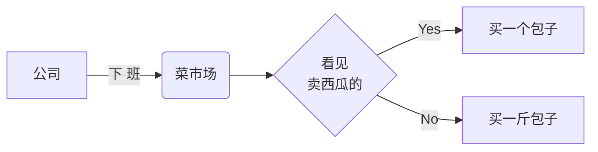
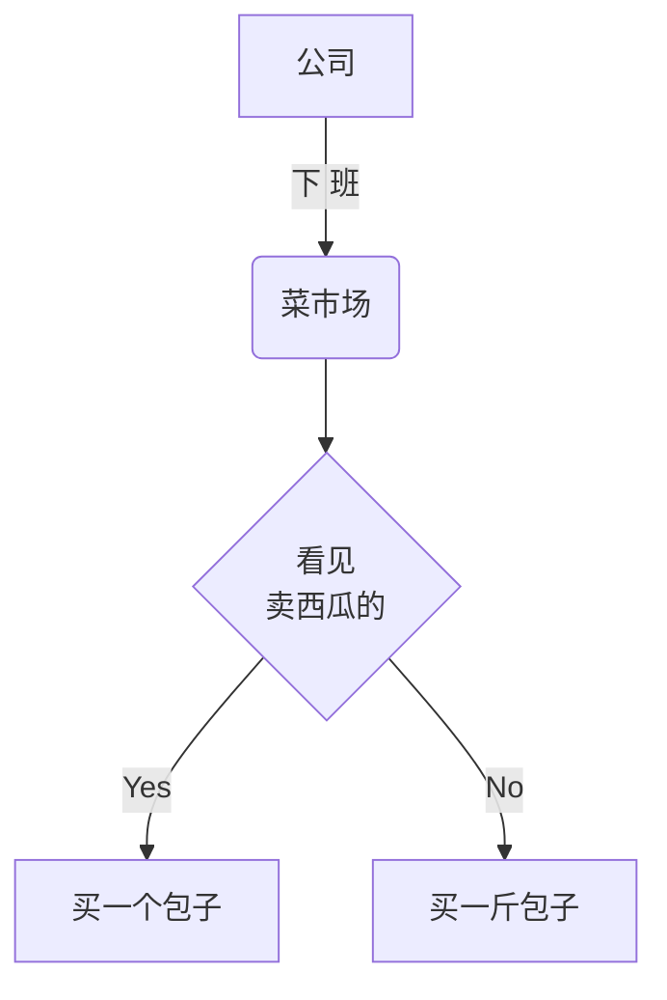
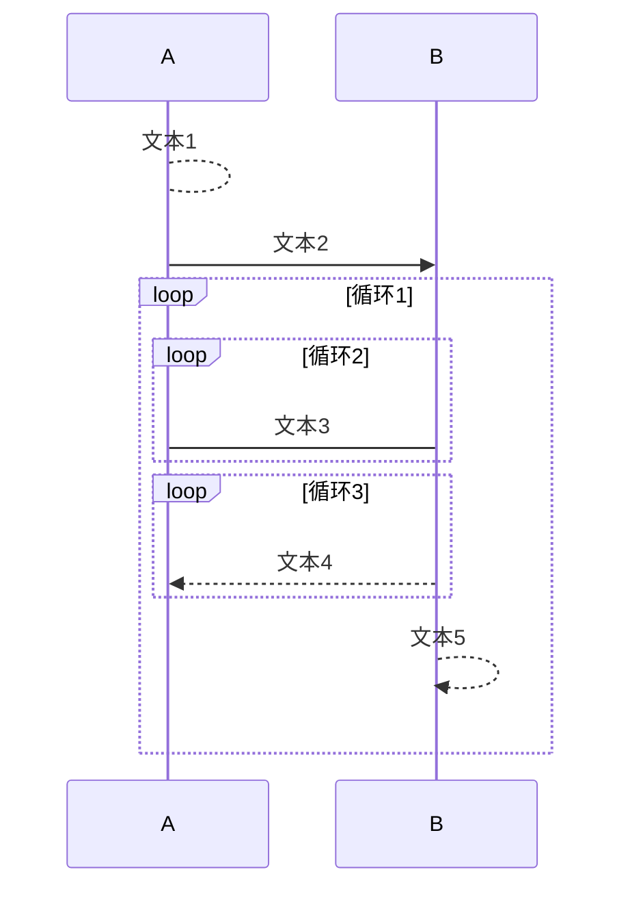
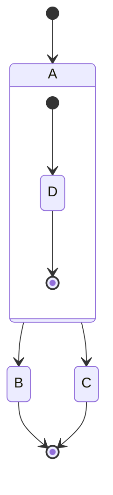
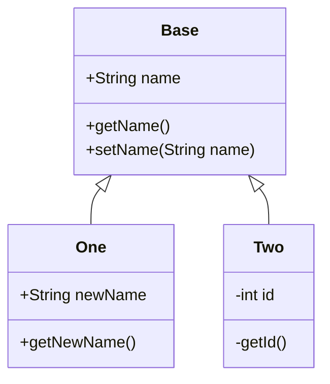
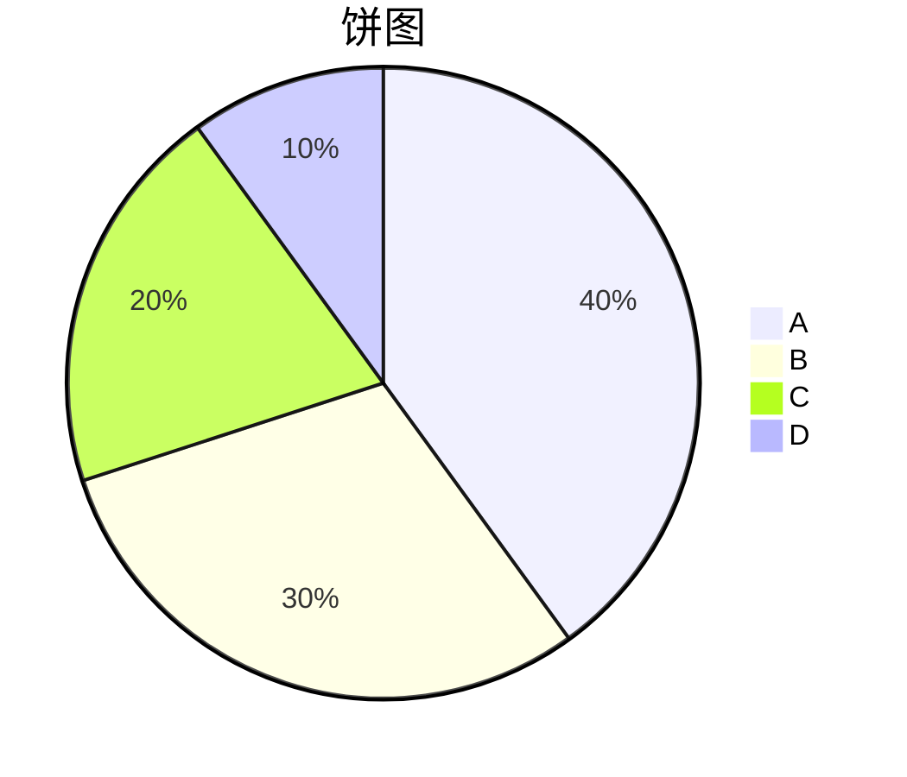

# 例子

- [H5](h5.html)
- [多实例](multiple.html)
- [无 toolbar](notoolbar.html)
- [纯预览模式](preview_only.html)
- [注入](xss.html)
- [API](api.html)
- [图片所见即所得编辑尺寸](img.html)

# Cherry Markdown 简明手册

[[toc]]

# 基本语法

---

## 字体样式

**说明**

- 使用`*(或_)` 和 `**(或__)` 表示*斜体*和 **粗体**
- 使用 `/` 表示 /下划线/ ,使用`~~` 表示~~删除线~~
- 使用`^(或^^)`表示^上标^或^^下标^^
- 使用 ! 号+数字 表示字体 !24 大! !12 小! [^专有语法提醒]
- 使用两个(三个)!号+RGB 颜色 表示!!#ff0000 字体颜色!!(!!!#f9cb9c 背景颜色!!!)[^专有语法提醒]

**示例**

```
[!!#ff0000 红色超链接!!](http://cherry.editor.com)
[!!#ffffff !!!#000000 黑底白字超链接!!!!!](http://cherry.editor.com)
鞋子 !32 特大号!
大头 ^`儿子`^ 和小头 ^^`爸爸`^^
爱在~~西元前~~**当下**
```

**效果**
[!!#ff0000 红色超链接!!](http://cherry.editor.com)
[!!#ffffff !!!#000000 黑底白字超链接!!!!!](http://cherry.editor.com)
鞋子 !32 特大号!
大头 ^`儿子`^ 和小头 ^^`爸爸`^^
爱在~~西元前~~**当下**

---

## 标题设置

**说明**

- 在文字下方加 === 可使上一行文字变成一级标题
- 在文字下方加 --- 可使上一行文字变成二级标题
- 在行首加井号（#）表示不同级别的标题，例如：# H1, ##H2, ###H3

---

## 超链接

**说明**

- 使用 `[描述](URL)` 为文字增加外链接
- 使用`<URL>`插入一个链接
- URL 会自动转成链接

**示例**

```
这是 [腾讯网](https://www.qq.com) 的链接。
这是 [一个引用的][引用一个链接] 的链接。
这是一个包含中文的链接<https://www.qq.com?param=中文>，中文
直接识别成链接：https://www.qq.com?param=中文，中文 用空格结束
[引用一个链接]
[引用一个链接]: https://www.qq.com
```

**效果**
这是 [腾讯网](https://www.qq.com) 的链接。
这是 [一个引用的][引用一个链接] 的链接。
这是一个包含中文的链接<https://www.qq.com?param=中文>，中文
直接识别成链接：https://www.qq.com?param=中文，中文 用空格结束
[引用一个链接]
[引用一个链接]: https://www.qq.com

---

## 无序列表

**说明**

- 在行首使用 \*，+，- 表示无序列表

**示例**

```
- 无序列表项 一`默认`
- 无序列表项 二
 第二行内容前输入一个空格，即可实现缩进
- 无序列表项 三
 - 无序列表3.1
 - 无序列表3.2
- 无序列表项 四
 + 无序列表4.1`空心圆`
 + 无序列表4.1
- 无序列表五
 * 无序列表5.1`实心方块`
 * 无序列表5.2

```

**效果**

- 无序列表项 一`默认`
- 无序列表项 二
  第二行内容前输入一个空格，即可实现缩进
- 无序列表项 三
- 无序列表 3.1
- 无序列表 3.2
- 无序列表项 四

* 无序列表 4.1`空心圆`
* 无序列表 4.1

- 无序列表五

* 无序列表 5.1`实心方块`
* 无序列表 5.2

---

## 有序列表

**说明**

- 在行首使用数字、字母、汉字和点表示有序列表

**示例**

```
1. 有序列表项 一`阿拉伯数字`
1. 有序列表项 二
 第二行内容前输入一个空格，即可实现缩进
1. 有序列表项 三
 I. 有序列表项 3.1`罗马数字`
 I. 有序列表项 3.2
 I. 有序列表项 3.3
1. 有序列表四
 a. 有序列表4.1`希腊字母`
 a. 有序列表4.2
 a. 有序列表4.3
1. 有序列表五
 一. 有序列表5.1`中文数字`
 一. 有序列表5.2
 一. 有序列表5.3
```

**效果**

1. 有序列表项 一`阿拉伯数字`
1. 有序列表项 二
   第二行内容前输入一个空格，即可实现缩进
1. 有序列表项 三
   I. 有序列表项 3.1`罗马数字`
   I. 有序列表项 3.2
   I. 有序列表项 3.3
1. 有序列表四
   a. 有序列表 4.1`希腊字母`
   a. 有序列表 4.2
   a. 有序列表 4.3
1. 有序列表五
   一. 有序列表 5.1`中文数字`
   一. 有序列表 5.2
   一. 有序列表 5.3

---

## 引用

**说明**

- 在行首使用 > 表示文字引用

**示例**

```
> 野火烧不尽，春风吹又生
```

**效果**

> 野火烧不尽，春风吹又生

---

## 行内代码

**说明**

- 使用 \`代码` 表示行内代码

**示例**

```
让我们聊聊 `html`
```

**效果**
让我们聊聊 `html`

---

## 代码块

**说明**

- 使用 三个` 表示代码块

**效果**

```
    这是一个代码块
    有两行
```

---

## 插入图像

**说明**

- 使用 `` 插入图像
- 截图，在编辑器中粘贴（ctrl+V）也可以插入图像
- 使用`` 可以调整图片大小[^专有语法提醒]

**示例**

```
标准图片  
设置图片大小(相对大小&绝对大小)  
设置图片对齐方式：
**左对齐**

**居中**

**右对齐**

**浮动左对齐**

开心也是一天，不开心也是一天
这样就过了两天，汪
```

**效果**
标准图片 
设置图片大小(相对大小&绝对大小) 
设置图片对齐方式：
**左对齐**

**居中**

**右对齐**

**浮动左对齐**

开心也是一天，不开心也是一天
这样就过了两天，汪

---

# 高阶语法手册

---

## 目录

**说明**

- 使用`[[toc]]`，会自动生成一个页面目录，目录内容由一级、二级、三级标题组成

---

## 语法高亮

**说明**

- 在```后面指明语法名
- 加强的代码块，支持四十一种编程语言的语法高亮的显示

**效果**
非代码示例：

```
$ sudo apt-get install vim-gnome
```

Python 示例：

```python
@requires_authorization
def somefunc(param1='', param2=0):
    '''A docstring'''
    if param1 > param2: # interesting
        print 'Greater'
    return (param2 - param1 + 1) or None

class SomeClass:
    pass

>>> message = '''interpreter
... prompt'''
```

JavaScript 示例：

```javascript
/**
 * nth element in the fibonacci series.
 * @param n >= 0
 * @return the nth element, >= 0.
 */
function fib(n) {
  var a = 1,
    b = 1;
  var tmp;
  while (--n >= 0) {
    tmp = a;
    a += b;
    b = tmp;
  }
  return a;
}

document.write(fib(10));
```

---

## checklist[^不通用提醒]

**说明**

- 输入`[ ]`或`[x]`，就会生成一个 checklist

**示例**

```
- [ ] AAA
- [x] BBB
- [ ] CCC
```

**效果**

- [ ] AAA
- [x] BBB
- [ ] CCC

---

## 公式[^不通用提醒]

**说明**

- 输入`$$`或`$`，就会生成一个公式
- 访问 [MathJax](http://meta.math.stackexchange.com/questions/5020/mathjax-basic-tutorial-and-quick-reference) 参考更多使用方法

**示例**

```
块级公式：$$
\begin{aligned}
P(B|A)&=\frac{P(AB)}{P(A)}\\
P(\overline{B}|A)&=1-P(B|A)=1-\frac{P(AB)}{P(A)}
\end{aligned}
$$
行内公式： $e=mc^2$
```

**效果**
块级公式：$$
\begin{aligned}
P(B|A)&=\frac{P(AB)}{P(A)}\\
P(\overline{B}|A)&=1-P(B|A)=1-\frac{P(AB)}{P(A)}
\end{aligned}

$$
行内公式： $e=mc^2$


-----


## 插入音视频
**说明**
- 使用 `!v[描述](视频链接地址)` 插入视频
    - 使用 `!v[描述](视频链接地址){poster=封面地址}` 插入视频并配上封面
- 使用 `!audio[描述](视频链接地址)` 插入音频


**示例**

```
这是个演示视频  !video[不带封面演示视频](img/demo.mp4)
这是个演示视频  !video[带封面演示视频](images/demo.mp4){poster=images/demo-dog.png}
这是个假音频!audio[描述](视频链接地址)
```
**效果**

这是个演示视频  !video[不带封面演示视频](img/demo.mp4)
这是个演示视频  !video[带封面演示视频](images/demo.mp4){poster=images/demo-dog.png}
这是个假音频!audio[描述](视频链接地址)


-----


## 简单表格[^专有语法提醒]
**说明**
- 使用两个竖线（||）生成简单表格
- 在表格开始位置输入三个竖线（|||）生成自动合并单元格的表格


**示例**
```
带标题：
||~项目                       ||~价格(居中)~   ||数量（右对齐）~  ||
|| 计算机 <br >(包括笔记本)  || $1600  ||   5    ||
|| 手机                       || $12    ||   5    ||
|| 管线                       || $1     ||   5    ||
不带标题：
|| 计算机 <br >(包括笔记本)  || $1600  ||   5    ||
|| 手机                       || $12    ||   5    ||
|| 管线                       || $1     ||   5    ||
自动合并：
|||~项目                      ||价格   ||数量  ||
|| 计算机  || $3600（高配）  ||   20    ||
|| 笔记本  || $2600（中配）  ||   30    ||
|| 笔记本  || $1600（低配）  ||   40    ||
|| 总计                       || $214000   ||   90    ||
```
**效果**
带标题：
||~项目                       ||~价格(居中)~   ||数量（右对齐）~  ||
|| 计算机 <br >(包括笔记本)  || $1600  ||   5    ||
|| 手机                       || $12    ||   5    ||
|| 管线                       || $1     ||   5    ||
不带标题：
|| 计算机 <br >(包括笔记本)  || $1600  ||   5    ||
|| 手机                       || $12    ||   5    ||
|| 管线                       || $1     ||   5    ||
自动合并：
|||~项目                      ||价格   ||数量  ||
|| 计算机  || $3600（高配）  ||   20    ||
|| 笔记本  || $2600（中配）  ||   30    ||
|| 笔记本  || $1600（低配）  ||   40    ||
|| 总计                       || $214000   ||   90    ||


-----


## 带对齐功能的表格
**说明**
- 一种比较通用的markdown表格语法


**示例**
```
|项目（居中对齐）|价格（右对齐）|数量（左对齐）|
|:-:|-:|:-|
|计算机|￥1600|5|
|手机机|￥12|50|
```
**效果**
|项目（居中对齐）|价格（右对齐）|数量（左对齐）|
|:-:|-:|:-|
|计算机|￥1600|5|
|手机机|￥12|50|


-----


## 带图表能力的表格
**说明**
- 支持自动生成柱状图、饼图


**示例**
```
| :bar: {x,y} | 2019 | 2020 | 2021 |
| :--- | ---: | ---: | ---: |
| DAU | 100,100 | 200,200 | 300,300 |
| UV | 1,000,000 | 2,000,000 | 3,000,000 |
| PV | 10,000,000 | 20,000,000 | 30,000,000 |


| :line: {x,y} | 2019 | 2020 | 2021 |
| :--- | ---: | ---: | ---: |
| DAU | 100,100 | 200,200 | 300,300 |
| UV | 1,000,000 | 2,000,000 | 3,000,000 |
| PV | 10,000,000 | 20,000,000 | 30,000,000 |
```
**效果**
| :bar: {x,y} | 2019 | 2020 | 2021 |
| :--- | ---: | ---: | ---: |
| DAU | 100,100 | 200,200 | 300,300 |
| UV | 1,000,000 | 2,000,000 | 3,000,000 |
| PV | 10,000,000 | 20,000,000 | 30,000,000 |


| :line: {x,y} | 2019 | 2020 | 2021 |
| :--- | ---: | ---: | ---: |
| DAU | 100,100 | 200,200 | 300,300 |
| UV | 1,000,000 | 2,000,000 | 3,000,000 |
| PV | 10,000,000 | 20,000,000 | 30,000,000 |


-----


## 流程图[^不通用提醒]
**说明**
- 访问[Mermaid 流程图](https://mermaid-js.github.io/mermaid/#/flowchart)参考具体使用方法。


**效果**
小明老婆让小明下班时买一斤包子，如果遇到卖西瓜的，买一个。

左右结构

上下结构



-----


## 时序图[^不通用提醒]
**说明**
- 访问[Mermaid 时序图](https://mermaid-js.github.io/mermaid/#/sequenceDiagram)参考具体使用方法


**效果**



-----


## 状态图[^不通用提醒]
**说明**
- 访问[Mermaid 状态图](https://mermaid-js.github.io/mermaid/#/stateDiagram)参考具体使用方法


**效果**



-----


## UML图[^不通用提醒]
**说明**
- 访问[Mermaid UML图](https://mermaid-js.github.io/mermaid/#/classDiagram)参考具体使用方法


**效果**



-----


## 饼图[^不通用提醒]
**说明**
- 访问[Mermaid 饼图](https://mermaid-js.github.io/mermaid/#/pie)参考具体使用方法


**效果**



-----


## 注释[^不通用提醒]
**说明**
- 使用中括号+冒号（[]:）生成单行注释
- 使用中括号+尖号+冒号（[^]:）生成多行注释
- 多行注释以连续两次回车结束


**示例**
```
下面是一行单行注释
[注释摘要]: 这是一段注释，不会显示到页面上
上面面是一行单行注释
下面是多行注释
[^注释摘要]: 这是一段多行注释，不会显示到页面上
可以换行
    可以缩进
以两次回车结束

上面是多行注释
```
**效果**
下面是一行单行注释
[注释摘要]: 这是一段注释，不会显示到页面上
上面面是一行单行注释
下面是多行注释
[^注释摘要]: 这是一段多行注释，不会显示到页面上
可以换行
    可以缩进
以两次回车结束

上面是多行注释


-----


## 脚注[^不通用提醒]
**说明**
- 在段落中引用多行注释即会生成脚注
- 脚注中括号中的数字以引用脚注的顺序自动生成
- 点击脚注的数字可以跳转到脚注详情或回到引用脚注位置


**示例**
```
这里需要一个脚注[^脚注别名1]，另外这里也需要一个脚注[^another]。
[^脚注别名1]: 无论脚注内容写在哪里，脚注的内容总会显示在页面最底部
以两次回车结束

[^another]: 另外，脚注里也可以使用一些简单的markdown语法
>比如 !!#ff0000 这里!!有一段**引用**

```
**效果**
这里需要一个脚注[^脚注别名1]，另外这里也需要一个脚注[^another]。
[^脚注别名1]: 无论脚注内容写在哪里，脚注的内容总会显示在页面最底部
以两次回车结束

[^another]: 另外，脚注里也可以使用一些简单的markdown语法
>比如 !!#ff0000 这里!!有一段**引用**


-----


# 编辑器操作能力


-----


## 通过快捷按钮修改字体样式


-----


## 复制html内容，粘贴成markdown
**说明**
- 粘贴html内容时会自动转成markdown，也可以选择粘贴为纯文本格式
- 可以拖拽调整预览区域的宽度


-----


## 快捷键
||~功能|| 按键||
||1级标题||    `Ctrl + 1`||
||2级标题||    `Ctrl + 2`||
||3级标题||    `Ctrl + 3`||
||4级标题||    `Ctrl + 4`||
||5级标题||    `Ctrl + 5`||
||6级标题||    `Ctrl + 6`||
||加粗||    `Ctrl + b`||
||斜体||    `Ctrl + i`	||
||插入链接||    `Ctrl + l`	||
||插入代码块||    `Ctrl + k`	||
||插入图片||     `Ctrl + g`	||
||插入公式||    `Ctrl + m`	||


## 协议
```
/**
 * Copyright (C) 2021 THL A29 Limited, a Tencent company.
 *
 * Licensed under the Apache License, Version 2.0 (the "License");
 * you may not use this file except in compliance with the License.
 * You may obtain a copy of the License at
 *
 *     http://www.apache.org/licenses/LICENSE-2.0
 *
 * Unless required by applicable law or agreed to in writing, software
 * distributed under the License is distributed on an "AS IS" BASIS,
 * WITHOUT WARRANTIES OR CONDITIONS OF ANY KIND, either express or implied.
 * See the License for the specific language governing permissions and
 * limitations under the License.
 */
```


[^专有语法提醒]: 该语法是**CherryMarkdown专有语法**，可能无法在其他markdown平台上使用该语法

[^不通用提醒]: 该语法不是markdown通用语法，无法保证在其他markdown平台上进行正确渲染


$$
